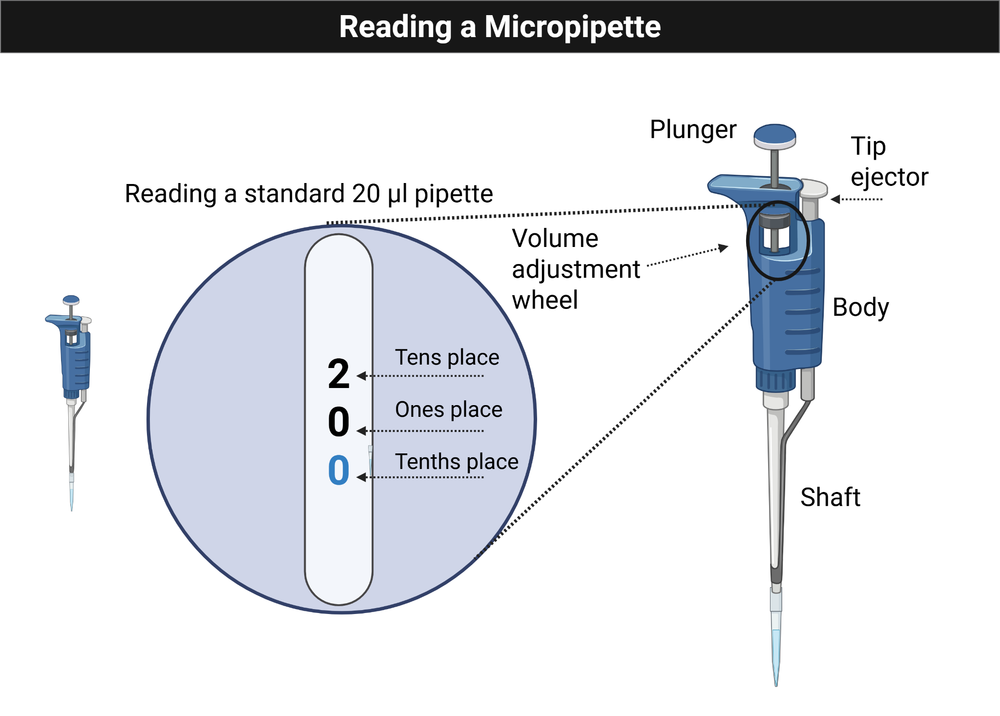
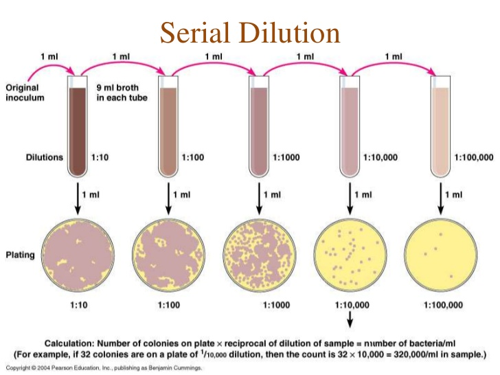
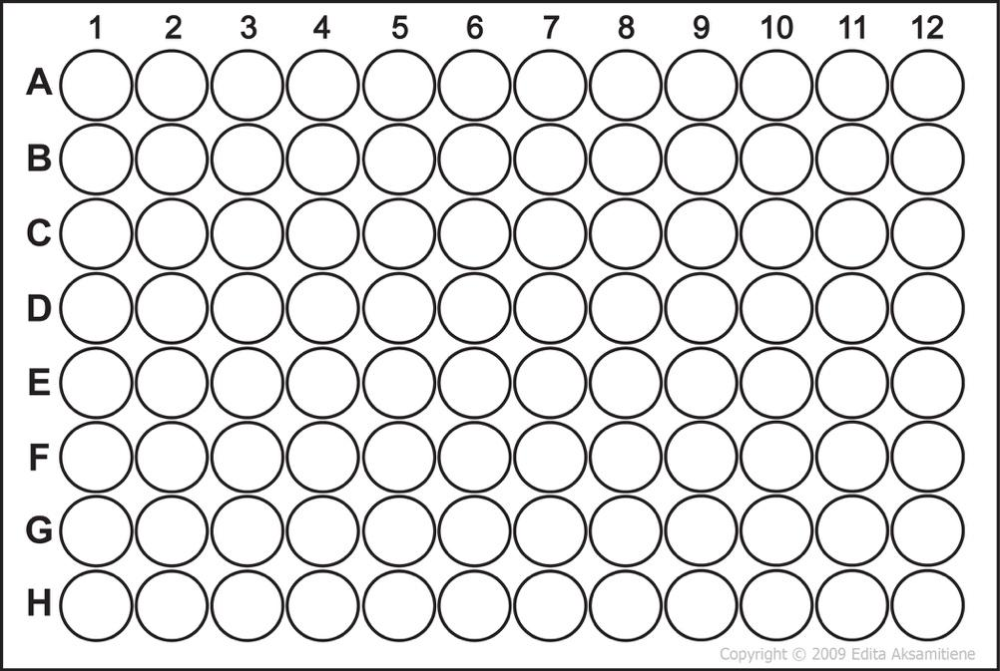

# Module 1: Getting Started

## Overview

Week 1 focuses on safe lab practice, pipetting fundamentals, and the first ELN entries for MB 360. Students review lab safety, practice using micropipettes, and document results in a way that prepares them for the rest of the course.

## Purpose

The goal of this module is to prepare you to work safely and efficiently in the lab. You will review safety procedures for the teaching labs in Thomas Hall, use personal protective equipment correctly, and practice working with mechanical micropipettors and electronic multichannel pipettes.

## Learning Outcomes

- List the personal protective equipment needed for MB 360.
- Identify the features of the mechanical pipettes used in the course.
- Explain how streak plating helps dilute bacteria.
- Describe the advantages of electronic and multichannel pipettes.
- Create a lab entry in the ELN system.
- Collect and interpret pipetting data.
- Create a team charter and communication plan.

## Skills and Knowledge

### Skills

- Follow basic safety precautions in a laboratory with live bacterial organisms.
- Transfer a range of liquid volumes reproducibly with pipettors.
- Document protocols, observations, and results in an ELN.
- Interpret variability in pipetting performance.

### Knowledge

- Pipettor types and their volume ranges.
- PPE expectations for microbial work.

## Task

Review the background and procedures before lab. During class, work with your lab partner to complete the pipetting activities, document all observations, and record any changes you made during the session.

## Criteria for Success

Successful completion requires active participation in the in-lab activities, completion of the pipetting exercises, collection of usable data, and a complete ELN entry with results and reflection.

## Background

The course uses teaching labs in Thomas Hall and focuses on work with Delftia acidovorans. Because environmental isolates may be naturally antibiotic-resistant, all work should minimize exposure and maintain good containment practices.

## Procedures

### Lab Safety

- Treat all tips as potential biohazards.
- Clean the bench before and after each session with 70% ethanol.
- Dispose of cultures and plates using the designated biohazard procedures.

### Methods: Practice Micropipetting With the Pipette Practice Card

Figure @fig-module1-pipette shows the micropipette volume display students should learn to read before beginning the practice-card exercise.

{#fig-module1-pipette fig-alt="Illustration of a micropipette with the volume display highlighted for reading the setting."}

- Add the correct amount of liquid to each circle and keep each drop within the circle.
- Have each group member try at least two different volumes.
- Practice picking up the entire drop without leaving liquid behind.
- Pipette several 5 uL drops and compare them for consistency.
- Combine four 4 uL additions into a single spot, predict the total volume, then test whether you can recover it fully.

### Methods: Volume Challenge

Your instructor will provide blue, yellow, and red dyed water. Use the Pipette Practice Card to complete the transfer and mixing exercise.

#### Mixing With a Micropipette

- When adding a second liquid to a dot, press only to the first stop.
- Release slowly to draw the same volume back up.
- Repeat until the colors are mixed evenly.
- Finish by pressing to the second stop and removing the tip cleanly.

#### Instructions

1. Add 13.5 uL of blue dye to dot A.
2. Add 17.5 uL of yellow dye to dot C.
3. Add 17 uL of red dye to dot E.
4. Transfer 2 uL from dot A to dot F.
5. Transfer 4.5 uL from dot C to dot B.
6. Transfer 3 uL from dot E to dot D.
7. Calculate the volume now present on each dot.
8. Mix 6 uL from dot E into dot F.
9. Mix 3.5 uL from dot A into dot B.
10. Mix 5 uL from dot C into dot D.

### Protocol Notes

Record any mistakes, deviations, or adjustments made during the experiment.

## Results

Paste a picture of the completed card and annotate it, or add written notes describing your observations.

## Result Analysis

Explain what the results show, whether the liquid transfers matched expectations, and what they suggest about your current pipetting precision.

## Discussion Questions

1. Did you make bubbles while mixing? What caused them?
2. Was any liquid left on the card or was there air space in the pipette tip after transfer?
3. Based on your results, how would you rate your pipetting skill?

## Serial Dilutions

### Purpose

Practice accurate small-volume pipetting while learning how serial dilutions work.

### Background

Serial dilution is the stepwise dilution of a solution by a constant factor. In this module, you will perform a 1:10 serial dilution of crystal violet in a 96-well plate to connect pipetting technique with quantitative analysis.

Figure @fig-module1-serial-overview summarizes the repeated transfer logic behind the serial dilution workflow.

{#fig-module1-serial-overview fig-alt="Diagram showing a serial dilution sequence from a concentrated source through progressively diluted samples."}

### Protocol

Use Figure @fig-module1-microplate to plan the first rows of the microplate before starting the transfers.

{#fig-module1-microplate fig-alt="Photo of the top rows of a 96-well microplate used as a planning guide for serial dilution."}

1. Add 50 uL of water to each well in row A.
2. Add 50 uL of crystal violet to well A1.
3. Mix A1 gently, then transfer 50 uL from A1 to A2.
4. Repeat across row A through A12.
5. Discard the final 50 uL after mixing A12.
6. Repeat the same process for rows B, C, and D as assigned between partners.
7. Add 100 uL of water to well H12 as a negative control.
8. Compare rows visually, then measure absorbance with the plate reader.

### Planning Prompts

Figure @fig-module1-plate-template can be copied into the ELN or notebook to sketch the intended arrangement of controls and dilutions.

{#fig-module1-plate-template fig-alt="Blank 96-well plate diagram labeled by row and column for planning experimental layouts."}

- Where does the water go?
- How much water is added to each well?
- Where is crystal violet added first?
- What transfer step is repeated each time?
- What should happen after mixing well A12?

### Reflection Prompts

1. What is the dilution factor in this series?
2. How dilute is the final sample relative to the starting dye?
3. Did the visual pattern match your prediction?
4. Did the plate reader data match your qualitative observations?