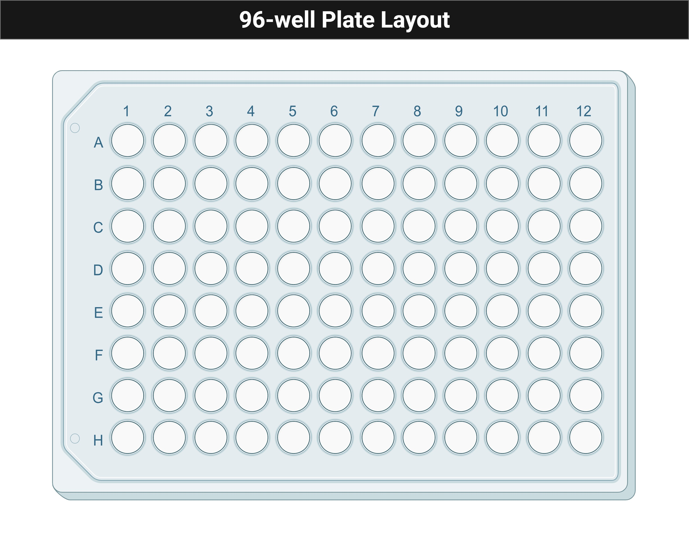

# Module 1: Getting Started

{#fig-module1-pipette fig-alt="Illustration of a micropipette with the volume display highlighted."}

- Add the correct amount of liquid to each circle and keep each drop within the circle.
- Have each group member try at least two different volumes.
- Practice picking up the entire drop without leaving liquid behind.
- Pipette several 5 µL drops and compare them for consistency.
- Combine four 4 µL additions into a single spot, predict the total volume, then test whether you can recover it fully.

### Methods: Volume Challenge

Your instructor will provide blue-, yellow-, and red-dyed water. Use the Pipette Practice Card to complete the transfer-and-mixing exercise.

#### Mixing With a Micropipette

- When adding a second liquid to a dot, press only to the first stop.
- Release slowly to draw the same volume back up.
- Repeat until the colors are mixed evenly.
- Finish by pressing to the second stop and removing the tip cleanly.

#### Instructions

1. Add 13.5 µL of blue dye to dot A.
2. Add 17.5 µL of yellow dye to dot C.
3. Add 17 µL of red dye to dot E.
4. Transfer 2 µL from dot A to dot F.
5. Transfer 4.5 µL from dot C to dot B.
6. Transfer 3 µL from dot E to dot D.
7. Calculate the volume now present on each dot.
8. Mix 6 µL from dot E into dot F.
9. Mix 3.5 µL from dot A into dot B.
10. Mix 5 µL from dot C into dot D.

### Protocol Notes

Record any mistakes, deviations, or adjustments made during the experiment.

## Results

Paste a picture of the completed card and annotate it, or add written notes describing your observations.

## Result Analysis

Explain what the results show, whether the liquid transfers matched expectations, and what they suggest about your current pipetting precision.

## Discussion Questions

1. Did you make bubbles while mixing? What caused them?
2. Was any liquid left on the card or was there air space in the pipette tip after transfer?
3. Based on your results, how would you rate your pipetting skill?

## Serial Dilutions

### Purpose

Practice accurate small-volume pipetting while learning how serial dilutions work.

### Background

You will conduct independent research projects using _Delftia acidovorans_ isolates. For these experiments (and for many future experiments in more advanced laboratory classes and independent research experiences), it is critical that you can pipette small volumes of liquid accurately and precisely. Without this skill, your data will not be reproducible.

**Serial dilution** is the step-wise dilution of a solution with a known concentration. For example, in the image below, a solution (“Original inoculum”, a concentrated bacterial culture) is being serially diluted 5 times. In the serial dilution shown, each tube is initially filled with 9 ml of “broth” (a liquid medium used for microbial cultures). In this experiment, the “broth” is our diluent – the liquid being used to dilute our solution. Next, 1 ml of the concentrated original inoculum is added to the first tube. The total volume of liquid in this tube is 10 ml (9 ml broth + 1 ml inoculum). Thus, the concentration of the solution in this tube is 1/10 of the concentration in the original inoculum (1 ml original inoculum/10 ml total volume). After the solution in this tube is mixed well, 1 ml is removed and transferred to the next tube. The concentration of the solution in the second tube is now 1/10 of that in the first tube, and 1/100 of that in the original inoculum. For this reason, we would refer to the experiment shown as a 1:10 serial dilution. Note that we use the same dilution factor for every dilution in the series – that is, each time we dilute by a factor of 10, and after five dilutions, the concentration of our last tube is 1/105, or 1/100,000.

Serial dilution is the stepwise dilution of a solution by a constant factor. In this module, you will perform a 1:10 serial dilution of crystal violet in a 96-well plate to connect pipetting technique to the logic of dilution.

Figure @fig-module1-serial-overview summarizes the repeated-transfer logic underlying the serial dilution workflow.

{#fig-module1-serial-overview fig-alt="Diagram showing a serial dilution sequence from a concentrated source through progressively diluted samples."}

### Protocol

Use Figure @fig-module1-microplate to plan the first rows of the microplate before starting the transfers.

{#fig-module1-microplate fig-alt="Photo of the top rows of a 96-well microplate used as a planning guide for serial dilution."}

Today, you will be performing a serial dilution of crystal violet (a purple dye). Instead of tubes, you will perform your dilutions in a 96-well microplate. This is a small, clear plastic plate with 8 rows or 12 small wells. Each well can hold up to ~250 μl of liquid.

For this protocol, your instructor will provide you with the concentrated solution (crystal violet) and the diluent (water).

Before pipetting anything, read the entire protocol (Parts 1-3) and create an experimental plan as described on page 3 (your first lab notebook entry, dated today).

#### Part 1: Lab partner 1 pipettes, lab partner 2 watches.
1. Pipette 50 μl of water into each well in row A of your microplate.
2. Carefully raise the plate to eye level and examine the wells from the side. Does it look like you pipetted the same volume into each well?
3. Pipette 50 μl of crystal violet solution only into well A1.
4. Using your pipetter, mix the liquids in well A1 by slowly and gently “pipetting up and down”. Be sure to depress the pipette plunger only to the first stop.
5. After mixing, be sure that you have fully dispensed all of the liquid from your pipette tip.
6. Eject your pipette tip into your red waste bag.
7. With a new tip, transfer 50 μl from well A1 into well A2.
8. Repeat the mixing procedure used for well A1.
9. After mixing, be sure that you have fully dispensed all of the liquid from your pipette tip.
10. Eject your pipette tip into your red waste bag.
11. Repeat this process until you have transferred 50 μl from well A11 into well A12.
12. After mixing the liquids in well A12, draw 50 μl into your pipette tip as if you were going to continue diluting into well “A13”.
13. Dispense the 50 μl into your waste container and eject your tip.

#### Part 2: Lab partner 2 pipets; lab partner 1 watches.
Lab partner 2 should repeat the exact same protocol, using Row B of the microplate.

#### Part 3: Repeat!
Lab partner 1 should repeat the exact same protocol, using Row C, and then lab partner 2 should repeat the exact same protocol, using Row D.

#### Part 4: Add a Negative Control.
Add 100 μl of water to well H12.

#### Part 5: Visual observations and data analysis.
1. Compare Rows A and B. Do you see any differences? Consider the overall pattern of color intensity going from left to right (column 1 to column 12), and also  compare each well (i.e., compare well A1 to well B1 and A2 to B2). Answer the relevant question on the post-lab.
2. Compare Rows C and D. Answer the relevant question on the post-lab.
3. Compare Row A to Row C (partner 1’s rows) and Row B to Row D (partner 2’s rows). Answer the relevant question on the post-lab.
4. Ask your instructor to help you use the lab’s microplate reader to measure the absorbance of the solutions in each well of your microplate.
5. Take a picture of your data.

Before you start actually pipetting, you should have your plan approved by your instructor. Below is an image of the top two rows of a 96-well microplate. Draw a similar image in your lab notebook. Then, using the serial dilution diagram shown on page 1 as a model, draw how you will set up your serial dilutions. (It is not necessary to draw this twice; just show what you will do with Row A.)

To do this correctly, read the protocol and indicate the following in your lab notebook using the diagram as appropriate and/or making a bulleted list beside the diagram.
1) Where does the water go?
2) How much water are you pipetting?
3) Where does the crystal violet dye go? 
4) How much of the dye will you pipette first?
5) Then what do you do? 
6) What steps do you repeat?
7) What do you do after you mix the crystal violet with the water in well A12?

After you’ve finished drawing your plan, use a pen or pencil to shade the wells in row B to predict the color intensity (darkness or lightness) of the solution in each well.

**Answer the following questions in your lab notebook:**
What is the dilution factor for this serial dilution? *If you don’t remember, read back over the explanation of the serial dilution technique above.
Compared to the concentrated crystal violet solution provided by your instructor, how dilute will your final sample (well A12 or B12) be?

After you’ve had your plan checked and completed your dilutions, answer the following questions in your lab notebook:
- Does your plate look like you predicted it would? 
- Compare your results to the shading you drew on page 3. If not, what looks different?
- Compare your replicates with your partner's. Are all four rows similar? If not, what is different?

After you’ve measured your plate with the plate reader, answer the following question in your lab notebook:
- Did the numerical (quantitative) data obtained from the plate reader match your visual (qualitative) observations? Why or why not? 

You can assess how well you performed your serial dilutions by measuring whether each subsequent well shows a decrease in optical density. Do you have any surprises?
