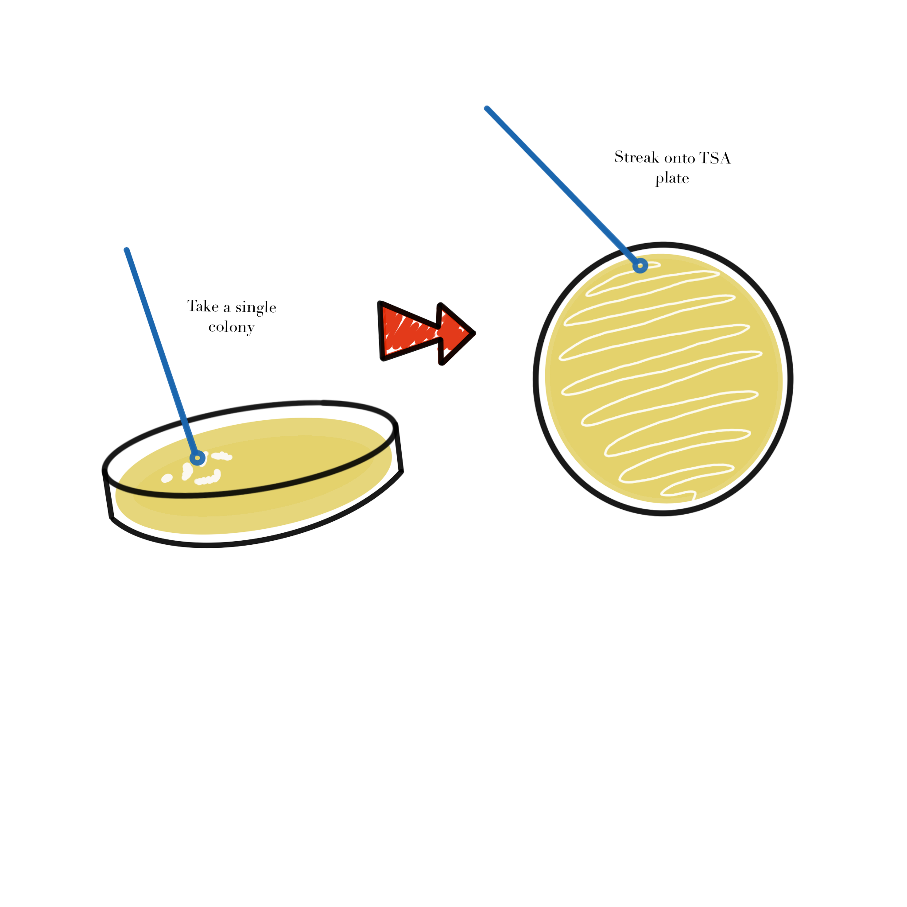

# Module 2: Microbial Propagation

## Overview

Weeks 2 and 3 focus on plate streaking, colony observation, and starting liquid cultures for later growth analysis.

## Purpose

- Recover and propagate Delftia acidovorans from colonies.
- Observe colony morphology, streak plates, and start liquid cultures.
- Review safety procedures for working with live microbial isolates.

## Learning Outcomes

- List the items needed to propagate microbes in liquid cultures and 96-well plates.
- Explain the stages of bacterial growth on a growth-curve graph.
- Describe defined, complex, selective, enriched, and differential media.
- Discuss the importance of controls.
- Practice inoculating and diluting liquid cultures.
- Describe the purpose, methods, and preliminary results of microbial growth experiments.
- Collect and interpret colony morphology and growth data.
- Create and use a team data management plan.

## Skills and Knowledge

### Skills

- Work safely with bacterial growth on agar plates.
- Document protocols and results clearly.
- Interpret colony morphology and growth in liquid TSB medium.
- Propagate bacteria in liquid culture.

### Knowledge

- PPE for microbial work.
- Loop use, sterilization, and streaking methods.
- Propagation of microorganisms in solid and liquid media.

## Task

Review the protocol before lab and work with your partner to complete the propagation tasks, document observations, and record changes to the procedure.

## Criteria for Success

You should complete the solid- and liquid-media propagation tasks, collect observations that can be analyzed, and submit a complete ELN entry.

## Background

This module uses Delftia acidovorans and related environmental isolates. Each group works with one isolate and is responsible for careful handling, observation, and documentation.

## Procedures

### Lab Safety

#### Before Lab

- Wear a lab coat, goggles, and gloves.
- Wipe the bench and pipettors with 70% ethanol.

#### During Lab

- Treat all tips as potential biohazards.
- Remove PPE when leaving the lab.
- Discard samples and disposables in the correct containers.
- Keep personal item use to a minimum.

#### After Lab

- Wipe the station with 70% ethanol.
- Decontaminate any personal items touched during lab.
- Dispose of gloves in the main biohazard container.

### Methods: Observe Colony Morphology

- Obtain a TSA plate containing colonies of your isolate.
- Observe colony appearance without opening the plate.
- Record size, shape, and any additional visible features.
- Photograph the plate using the provided black background.
- Share the photos with all team members.

### Methods: Plate Streaking

Figure @fig-module2-streaking illustrates the transfer of a single colony to a fresh plate during the streaking workflow.

{#fig-module2-streaking fig-alt="Diagram showing a sterile loop transferring a single colony onto a fresh agar plate for streaking."}

- Use a sterile loop to pick a single colony.
- Open the plate as little as possible.
- Streak onto a fresh TSA plate.
- Label the plate with your name, class, and date on the bottom edge.

### Methods: Starting a Liquid Culture

- Obtain TSB and sterile culture tubes.
- Label tubes for the TSB control, your isolate, and Delftia acidovorans SPH-1.
- Transfer a colony into the labeled tube without touching the loop to any other surface.
- Cap each tube correctly and place them in a shaking incubator at 30 C.
- Incubate for 24 hours.

### Protocol Notes

Record any mistakes, deviations, or isolate-specific observations.

## Results

Add a photo of the plate and notes describing what you observed.

## Result Analysis

Explain whether the observed colony features and culture setup matched expectations.

## Discussion Questions

1. If a student touched the agar with a thumb and unexpected colonies appeared later, what was the likely source of contamination and how could it have been prevented?
2. What differences would you predict between static and shaking liquid growth?