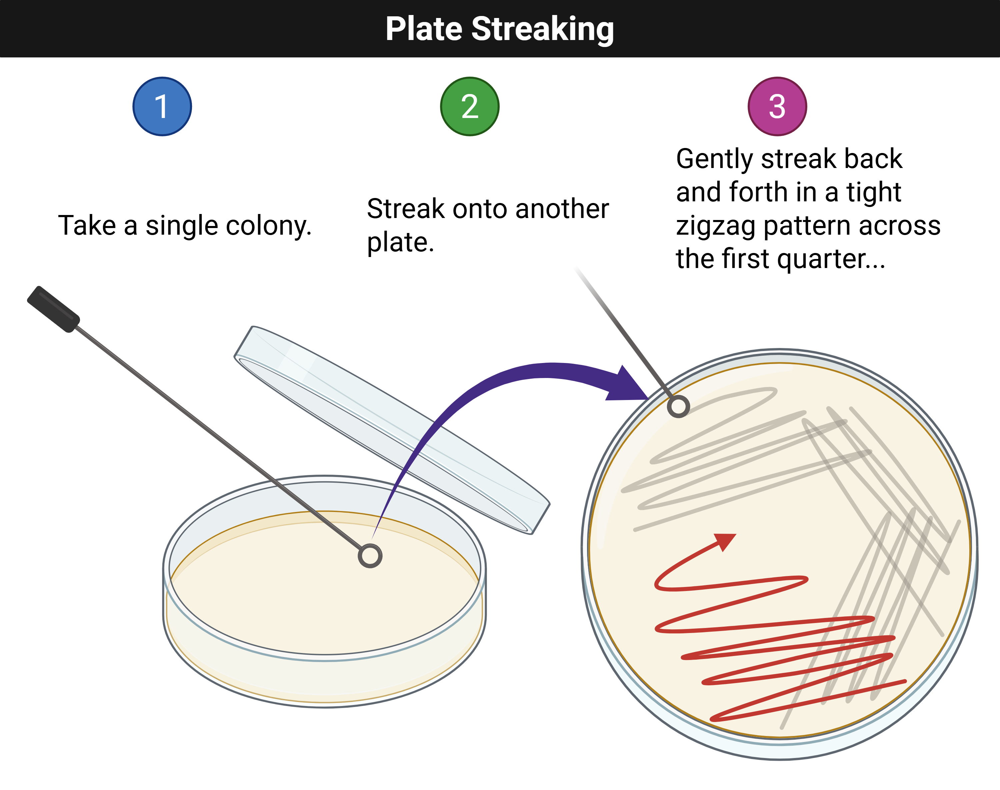
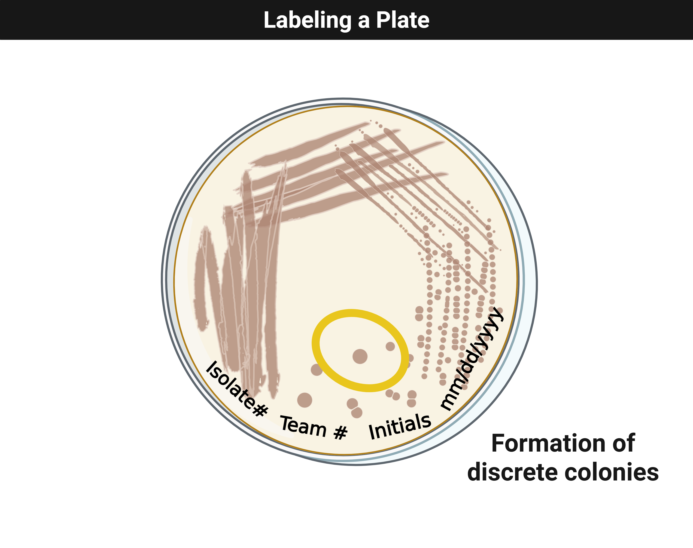

# Module 2: Microbial Propagation

:::{.slide-link}
[View Slide Deck](slides/module-02-slides.html){.btn target="_blank" rel="noopener noreferrer" aria-label="Open Module 2 slide deck in a new tab"}
:::

## Overview

Weeks 2 and 3 focus on plate streaking, colony observation, and starting liquid cultures for later growth analysis.

## Purpose

- Recover and propagate *Delftia acidovorans* from colonies.
- Observe colony morphology, streak plates, and start liquid cultures.
- Review safety procedures for working with live microbial isolates.

## Learning Outcomes

- **List** the items needed to propagate microbes in liquid cultures and 96-well plates.
- **Explain** the stages of bacterial growth on a growth-curve graph.
- **Describe** defined, complex, selective, enriched, and differential media.
- **Discuss** the importance of controls.
- **Practice** inoculating and diluting liquid cultures.
- **Describe** the purpose, methods, and preliminary results of microbial growth experiments.
- **Collect** and **interpret** colony morphology and growth data.
- **Create** and **use** a team data management plan.

## Skills and Knowledge

### Skills

- Work safely with bacterial growth on agar plates.
- Document protocols and results clearly.
- Interpret colony morphology and growth in liquid TSB medium.
- Propagate bacteria in liquid culture.

### Knowledge

- PPE for microbial work.
- Loop use, sterilization, and streaking methods.
- Propagation of microorganisms in solid and liquid media.

## Task

Review the protocol before lab and work with your partner to complete the propagation tasks, document observations, and record changes to the procedure.

## Criteria for Success

You should complete the solid- and liquid-media propagation tasks, collect observations that can be analyzed, and submit a complete ELN entry.

## Background

Our lab experiments will use the bacterium *Delftia acidovorans*. Since we will work with environmental isolates that may be naturally antibiotic-resistant, we want to minimize exposure and contain any potential biohazards. We will work with several different isolates. Each group will characterize one isolate.

## Procedures

### Lab Safety

#### Before Lab

:::{.callout-caution}
Note that we will be working with live microbial isolates today. Please follow all safety protocols and dispose of potentially biohazardous materials properly.
:::
- Wear a lab coat, goggles, and gloves.
- Wipe the bench and pipettors with 70% ethanol.

#### During Lab

- Treat all tips as potential biohazards.
- Remove PPE when leaving the lab.
- Discard samples and disposables in the correct containers.
- Keep personal item use to a minimum.

#### After Lab

- Wipe the station with 70% ethanol.
- Decontaminate any personal items touched during lab.
- Dispose of gloves in the main biohazard container.

### Methods: Observe Colony Morphology

- Obtain a TSA plate containing colonies of your isolate.
- Observe colony appearance without opening the plate.
- Record size, shape, and any additional visible features.
- Photograph the plate using the provided black background.
- Share the photos with all team members.

### Methods: Plate Streaking

Figure @fig-module2-streaking illustrates the transfer of a single colony to a fresh plate during the streaking workflow.

{#fig-module2-streaking fig-alt="Diagram showing a sterile loop transferring a single colony onto a fresh agar plate for streaking practice."}

- Obtain a sterile loop and/or a package of disposable sterile loops. Take out a loop when you are ready to use it. Be careful not to touch the loop with anything else except the intended bacteria to prevent contamination.
- Open the plate as little as possible.
- Streak onto a fresh TSA plate using a three-phase pattern to dilute toward single colonies.
- Label the **bottom** of the plate (not the lid) with your isolate name, class section, and date.

### Methods: Plate Labeling

Figure @fig-module2-labeling shows the correct placement and content of labels on the bottom of an agar plate.

{#fig-module2-labeling fig-alt="Diagram showing how to label the bottom of an agar plate with isolate name, section, group number, and date."}

- Write on the **bottom** of the plate with a permanent marker.
- Include your **isolate name, class section, group number, and the date.**
- Keep labels near the edge so they do not obscure the agar surface.
- Photograph the labeled bottom for your ELN record.

### Methods: Starting a Liquid Culture

- Obtain a 50 mL tube with Tryptic Soy Broth (TSB) and sterile culture tubes.
- Label tubes for the TSB control, your isolate, and *Delftia acidovorans* SPH-1.
- Transfer a colony into the labeled tube. Use a sterile loop to obtain a colony and, without touching it to any surface, use one hand to open the test tube slightly and the other to swirl the loop with bacteria in the media.
- Confirm that the tubes are labeled and capped to the first stop; the caps will jiggle a little but not come off. This is ok!
- Place the tubes in the shaking incubator set to 30°C.
- Incubate for 24 hours.

## Data
Record observations of colony morphology:

- Color
- Size range
- Shape
- Edges
- Texture or sheen
- Other observations

Liquid culture setup
- Tube labels used
- Inoculation notes
- Shaking versus static plan
- Start time

## Results

::: {.callout-note}
## Replace the note with the description of the results obtained. Paste images of the original TSA plate, streaked TSA plate, and liquid culture tubes. Add short captions and describe what you observed
:::

# Result Analysis

::: {.callout-note}
## Write an analysis of your results; explain what these results mean, and whether this matches what was expected:
:::

# Discussion

1. If a student touched the agar with a thumb and unexpected colonies appeared later, what was the likely source of contamination and how could it have been prevented?

2. What differences would you predict between static and shaking liquid growth?

::: {.callout-note}
## Replace the note with your discussion.
:::

# Reflection
- What worked well?
- What challenges did you encounter?
- What would you change next time?
- What is one question you still have?

::: {.callout-note}
## Replace the note with your Reflection.
:::

# Checklist Before Submission
- [ ] All sections completed
- [ ] Images pasted and labeled
- [ ] Discussion questions answered
- [ ] Reflection written
- [ ] Notebook saved and pushed to GitHub

