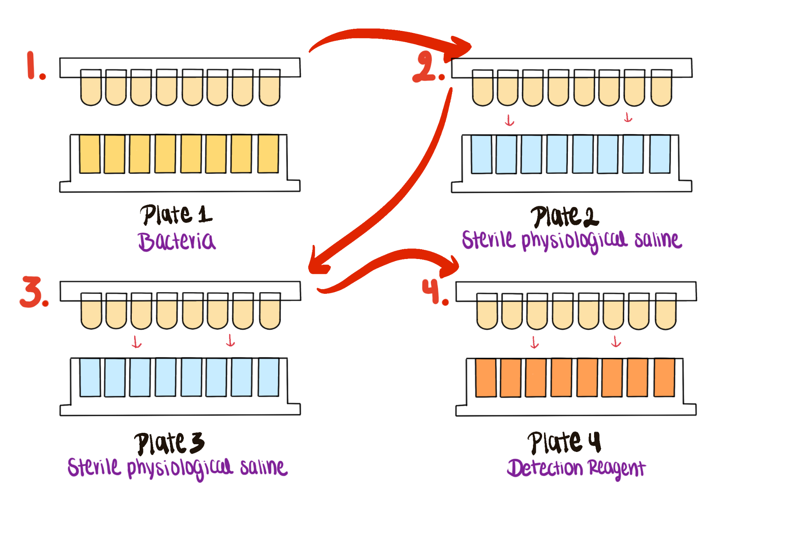

# Module 3: Microbial Growth Curves

## Overview

Weeks 4 and 5 focus on growth-curve experiments, multichannel pipetting, and biofilm viability assays.

## Purpose

- Evaluate growth rates of different *Delftia* species.
- Prepare liquid cultures from single colonies for 96-well growth assays.
- Analyze growth parameters from shaking cultures.
- Investigate differences in biofilm formation among isolates.

## Learning Outcomes

- List safety considerations for propagating microbes.
- Explain the differences between static and shaking growth.
- Describe the features of biofilms.
- Discuss the significance of growth curves.
- Practice using a multichannel pipette.
- Practice diluting overnight cultures and seeding 96-well plates consistently.
- Describe the purpose, methods, and preliminary results of microbial propagation experiments.
- Collect and interpret growth and biofilm data.
- Create an annotated bibliography with at least five sources.

## Skills and Knowledge

### Skills

- Work safely with liquid cultures in 96-well plates.
- Document protocols and results clearly.
- Interpret growth-curve and biofilm data.
- Propagate bacteria in liquid culture.

### Knowledge

- PPE requirements for microbial work.
- Propagation of microorganisms in liquid media.
- Seeding 96-well plates for growth and biofilm analyses.

## Task

Review the procedures before lab and work with your partner to complete the growth and biofilm assays and document all observations.

## Criteria for Success

Successful completion requires participation in both assay workflows, collection of analyzable data, and a complete ELN entry.

## Background

This module compares growth and biofilm formation in *Delftia acidovorans*, *Delftia tsuruhatensis*, and student isolates while maintaining strong contamination control.

## Procedures

### Lab Safety

- Wear the required PPE.
- Clean the bench and pipettors with 70% ethanol.
- Treat all tips as biohazards.
- Dispose of plates and gloves in the correct waste streams.

### Methods: Liquid Culture Setup

1. Isolated colonies were transferred to liquid medium.
2. Inoculated tubes were grown overnight at 30 C with shaking at 200 to 250 RPM.

### Methods: Growth Assay Setup

Figure @fig-module3-growth-layout provides a reusable 96-well template for mapping control wells and isolate conditions before loading the plate.

{#fig-module3-growth-layout fig-alt="Blank 96-well plate diagram for organizing growth-curve and control conditions."}

- Prepare 1:1000 dilutions of the overnight cultures.
- Use positive and negative controls.
- Pour diluted cultures into sterile reservoirs.
- Use a multichannel pipette to add 100 µL to the assigned 96-well plate columns.
- Seal the plate with a breathable seal.
- Load the plate into the plate reader for 48 hours at 30 C with shaking.

### Methods: Biofilm Assay Setup

- Prepare fresh 1:1000 dilutions for the biofilm plate.
- Seed the assigned wells with 100 µL per well.
- Add the peg lid without contaminating the pegs.
- Incubate for 48 hours at 30 C.

### Methods: Biofilm Viability

Figure @fig-module3-biofilm-viability outlines the wash-and-detection workflow used to measure biofilm viability after incubation.

{#fig-module3-biofilm-viability fig-alt="Workflow diagram showing peg-lid washing steps followed by incubation in detection reagent for a biofilm viability assay."}

- Wash the peg lid using PBS in separate plates.
- Prepare the detection reagent with WST solution, electron mediator reagent, and TSB.
- Transfer the peg lid to the reagent plate and incubate at 37 C.
- Measure absorbance at 450 nm.

### Protocol Notes

Record any mistakes, deviations, or isolate-specific observations.

## Results

### Growth Curves

- Save and share the raw plate-reader data.
- Format the data for analysis.
- Upload the data file to the repository.
- Plot growth curves and compare isolates and wells.

### Biofilm Viability

- Save and share the raw absorbance values.
- Subtract the average TSB-only background.
- Calculate average absorbance and standard deviation for each condition.
- Plot the background-corrected averages for comparison.

## Result Analysis

Use your code and plots to explain whether the observed growth and biofilm behavior matched expectations.

## Discussion Questions

1. Why are biofilms difficult to eliminate, even when antibiotics are used?
2. What growth-curve pattern would you expect for your isolate, and why?