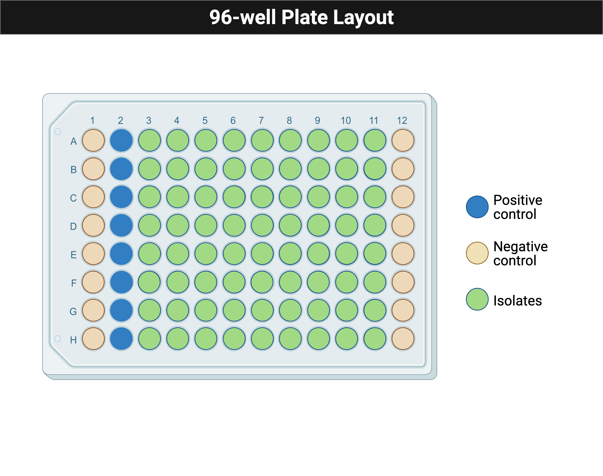
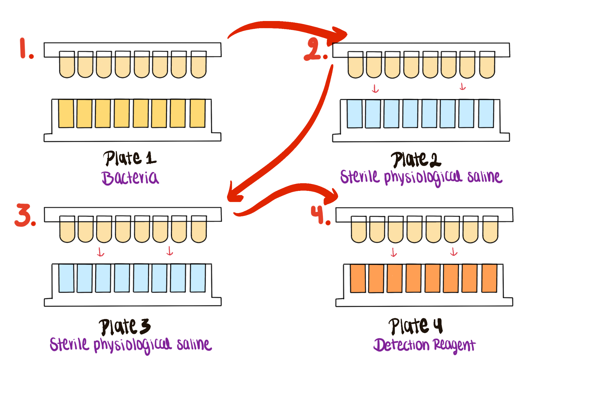

# Module 3: Microbial Growth Curves

## Criteria for Success

Successful completion requires participation in both assay workflows, collection of analyzable data, and a complete ELN entry.

## Background

This module compares growth and biofilm formation in *Delftia acidovorans*, *Delftia tsuruhatensis*, and student isolates while maintaining strong contamination control.

## Procedures

### Lab Safety

- Wear the required PPE.
- Clean the bench and pipettors with 70% ethanol.
- Treat all tips as biohazards.
- Dispose of plates and gloves in the correct waste streams.

### Methods: Liquid Culture Setup

1. Isolated colonies of your bacteria were picked and transferred to a liquid culture medium.
2. Inoculated liquid culture tubes were placed in a shaker at 30°C (degrees Celsius) overnight with shaking (200-250 RPM).

### Methods: Growth Assay Setup

Figure @fig-module3-growth-layout provides a reusable 96-well template for mapping control wells and isolate conditions before loading the plate.

{#fig-module3-growth-layout fig-alt="Blank 96-well plate diagram for organizing growth-curve and control conditions."}

1. For growth curves, obtain your overnight cultures and prepare **1:1000** dilutions as follows:
  a. **25 µl** of overnight culture into **25 ml** of fresh TSB prepared for you for your positive control (Delftia acidovorans SPH-1) and your isolate.
  b. **25 µl** of the overnight TSB control into **25 ml** of fresh TSB prepared for you as your negative control
2. Mix each 50 mL conical tube by inverting several times and vortexing.
3. Carefully pour your diluted cultures into a white plastic sterile reservoir.

    a. Use one plastic reservoir for the positive control and use a separate one for the negative control 
  
    b. Prepare your plastic reservoir when you are ready to use it to avoid contamination!

5. With a multichannel set to **100 ul**, take 8 p200 tips and pipette **100 µl** of culture into columns of a 96-well plate as follows. Keep the plate covered with the lid whenever possible to prevent contamination.

    i. **Columns 1 and 12** will receive TSB alone - pipette last to minimize contamination

    ii. **Columns 2, 3, 4, 5, and 6** will receive TSB + Delftia acidovorans SPH-1

    iii. **Columns 7, 8, 9, 10, and 11** will receive your TSB + Delftia isolate.

6. Carefully seal the plate using Breathe-Easy seals to allow exchange of oxygen, carbon dioxide, and water vapors while preventing microbial/viral contamination and well-to-well cross-contamination. Follow this video on how to use Breathe-Easy: 



7. Label the side of the plate with your **team name, group number, Delftia isolate, and date.**
8. Gently place the plate in the Agilent LogPhase600 plate reader, verifying that position A1 is on the top right. Ensure it is locked into position.
9. Note the position (1-4) of your plate and wait for the instructors to start growth curves at 30°C with shaking for 48 hours.
10. Instructors will share with you the spreadsheet with absorbance readings at 600 nm and time points when the run finishes.

### Methods: Biofilm Assay Setup

For biofilm formation and viability, we will use the Dojindo Biofilm Viability Assay B603:
1. For “seeding” your plate, take your overnight cultures and prepare **1:1000 dilutions** as follows:

    a. **25 µl** of overnight culture into **25 ml** of fresh TSB prepared for you for your positive control (Delftia acidovorans SPH-1) and your isolate.

    b. **25 µl** of the overnight TSB control into **25 ml** of fresh TSB prepared for you as your negative control

2. Mix each 50 mL conical tube by inverting several times and vortexing.
3. Carefully pour your diluted culture into a white plastic sterile reservoir.

    a. Use one plastic reservoir for the positive control and use a separate one for the negative control

    b. Prepare your plastic reservoir when you are ready to use it to avoid contamination!
   
4. With a multichannel set to 180 µl, take 8 p200 tips and pipette 100 ul of culture into columns of a 96-well plate as follows. Keep the plate covered with the lid whenever possible to prevent contamination.

    i. Columns 1 and 12 will receive TSB alone - pipette last to minimize contamination

    ii. Columns 2, 3, 4, 5, and 6 will receive TSB + Delftia acidovorans SPH-1

    iii. Columns 7, 8, 9, 10, and 11 will receive your TSB + Delftia isolate.

 a. Carefully open a peg-lid container, ensuring the pegs do not touch surfaces.

  b. Place the lid on the plate, submerging all pegs into the cultures and TSB.

  c. Label the side of the plate with your team name, group number, Delftia isolate, and date.

  d. Place the plate in the appropriate incubator, verifying that position A1 is on the top right.

  e. Check that the temperature is set to 30°C.

  f. We will remove the plate after 48 hours to wash the pegs and perform a viability stain as described below.

### Methods: Biofilm Viability

Figure @fig-module3-biofilm-viability outlines the wash-and-detection workflow used to measure biofilm viability after incubation.

{#fig-module3-biofilm-viability fig-alt="Workflow diagram showing peg-lid washing and viability readout steps."}

1. Label new plates as: Plate 2, Plate 3, and Plate 4.
2. Add **200 μl of sterile physiological saline (PBS)** solution to each well of 96-well Plate 2 and 96-well Plate 3. 
3. Wash the 96-peg lid from your plate with bacteria by soaking it in 96-well plates 2 and 3

::: {.callout-note}
✨Important: Please soak the lid in saline gently and avoid vigorous shaking. The incubation time for coloration depends on the species of microorganism and the test substance.
:::

4. Mix **990 μl** of WST Solution and **110 μl** of Electron Mediator Reagent in a conical tube, and add **20.9 ml** of Tryptic Soy Broth (TSB) to prepare the **detection reagent.**
5. Carefully and accurately fill each well of Plate 4 with **200 μl** of the detection reagent.
6. Place the 96-peg lid onto 96-well Plate 4 and incubate the plate at 37°C.
7. Remove the 96-peg Lid and measure the absorbance at **450 nm with a microplate reader.**

### Methods: Growth Curves 

1. Save your raw data and share it with your group. The spreadsheet includes readings at every time point for your plate.
2. Upload the text file to your repository for analysis.
3. Plot growth curves for your plate and compare each well and isolate.

### Methods: Biofilm Viability

1. Save your raw data and share it with your group. The spreadsheet includes absorbance values for each well after using the WST assay, which produces a color change when cells are metabolically active.
2. Duplicate the spreadsheet to create a copy you can edit and format for your calculations.
3. Calculate the average absorbance for your negative (TSB only) controls.
4. Subtract the average TSB-only absorbance from all wells: this is your background absorbance.
5. Now calculate the average absorbance for each column of background-corrected absorbance values.
6. Calculate the standard deviation for each column of background-corrected absorbance values.
7. Plot the average absorbance for each column and then compare the average growth for each isolate.

## Data/Results

::: {.callout-note}
Run the code with your data to produce the results and charts necessary for results analysis.
:::

## Result Analysis

::: {.callout-note}
Write an analysis of your results; explain what these results mean, and if this matches what was expected
:::

## Discussion 

- Biofilms are notoriously difficult to eliminate and often require physical removal. In many cases, however, physical removal isn’t possible, and antibiotics are surprisingly ineffective. What makes biofilms so tough? Explain how their structure and behavior help them survive antibiotic treatment!

- What results would you expect from your growth curve?

::: {.callout-note}
Write your answers to the questions above here
:::

## Checklist Before Submission

- [ ] All sections completed
- [ ] Images pasted and labeled
- [ ] Discussion questions answered
- [ ] Reflection written
- [ ] Notebook saved and pushed to GitHub

