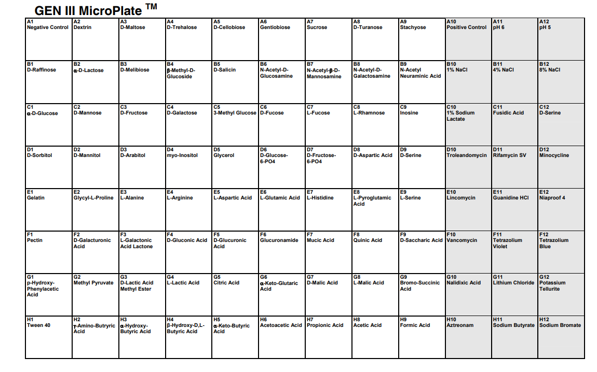
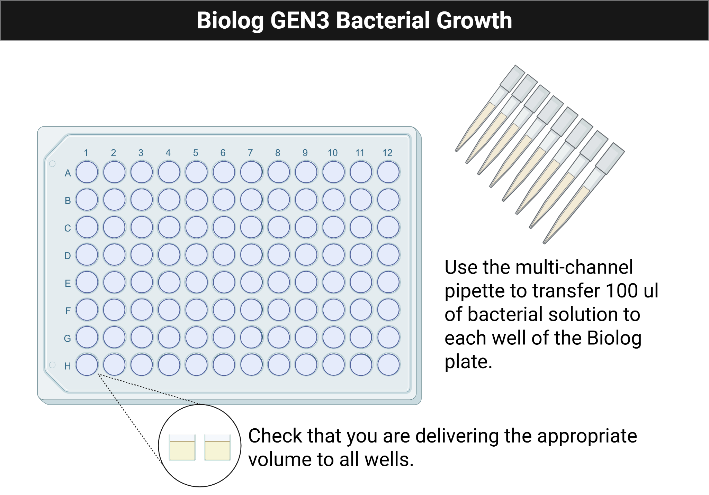
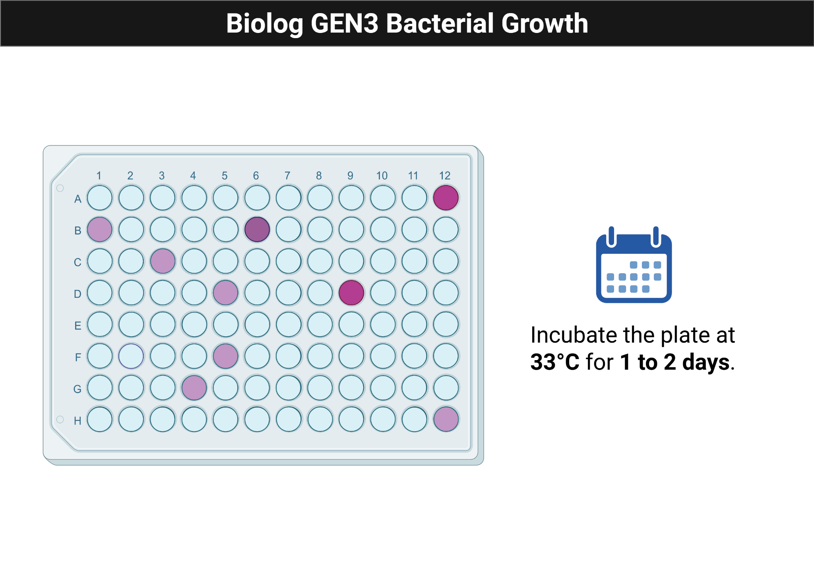

# Module 4: Microbial Metabolism

## Overview

Weeks 6 and 7 focus on Biolog GEN III phenotypic characterization, growth measurements, and metabolic interpretation.

## Purpose

- Evaluate and analyze bacterial growth in different environments.
- Perform metabolic profiling.
- Identify conditions that support or inhibit bacterial growth.
- Use multichannel pipettes to seed 96-well plates for growth assays.
- Apply the principles behind Biolog GEN III plates to your overall experiment.

## Learning Outcomes

- List safety considerations for propagating microbes.
- Explain the purpose of GEN III Biolog plates and metabolic tests.
- Describe the features of biofilms.
- Discuss the significance of growth curves.
- Practice using a multichannel pipette.
- Use a turbidimeter to adjust inoculum turbidity.
- Seed 96-well plates consistently without contamination.
- Describe the purpose, methods, and preliminary results of GEN III phenotypic characterization experiments.
- Collect and interpret growth data from Biolog GEN III plates.
- Create a draft for the individual and group projects.
- Explain how the experiment contributes to the overall research goal.

## Skills and Knowledge

### Skills

- Follow PPE and microbial safety procedures.
- Use Biolog plates and multichannel pipettors correctly.
- Use a turbidimeter to adjust bacterial density.
- Analyze bacterial growth data from 96-well plates.

### Knowledge

- PPE requirements for microbial work.
- Phenotypic assays and growth assessment.
- Seeding 96-well plates for bacterial growth.

## Task

Review the background and procedure information before lab and work with your partner to complete the assay setup and documentation.

## Criteria for Success

Complete the in-lab assay setup, collect analyzable data, and finish the ELN entry with observations and interpretation.

## Background

Biolog Blood Universal Growth agar and GEN III MicroPlates make it possible to test bacterial growth across many environmental and chemical conditions at once. The plate uses metabolic dye chemistry to report growth and biochemical activity across up to 94 tests.

Figure @fig-module4-biolog-layout shows the overall GEN III plate layout used to interpret the phenotypic results.

{#fig-module4-biolog-layout fig-alt="Biolog GEN III plate layout showing the distribution of test conditions across the wells."}

## Procedures

### Lab Safety

#### Before Lab

- Wear lab coat, goggles, and gloves.
- Wipe benches and pipettors with 70% ethanol.

#### During Lab

- Treat all tips as biohazards.
- Remove PPE when leaving the lab.
- Use personal devices as little as possible.

#### After Lab

- Clean work areas and personal items with ethanol.
- Dispose of liquids, plates, gloves, and glass using the assigned workflow.
- Return reusable materials and wash hands.

### Methods: Activity 1, Turbidimeter

- Blank the turbidimeter with uninoculated IF-A fluid.
- Swab bacteria from the BUG agar plate into IF-A inoculating fluid.
- Mix gently and measure turbidity.
- Adjust the inoculum to a target density of 95% transmittance.

### Methods: Activity 2, Biolog Plate Preparation

Figure @fig-module4-biolog-loading shows the multichannel loading pattern used to inoculate each column consistently.

{#fig-module4-biolog-loading fig-alt="Illustration showing a multichannel pipette transferring inoculum into a 96-well Biolog plate."}

Figure @fig-module4-biolog-incubation shows the expected appearance of an inoculated Biolog plate after incubation.

{#fig-module4-biolog-incubation fig-alt="Illustration of a Biolog GEN III plate with several purple wells indicating post-incubation growth response."}

- Pour the prepared cell suspension into a multichannel reservoir.
- Load the multichannel pipette and add 100 uL to each well of the GEN III plate.
- Replace tips whenever contamination is possible.
- Confirm that every well contains liquid.
- Incubate one plate in the plate reader and another statically at 33 C for 1 to 2 days.

### Protocol Notes

Record any mistakes, deviations, or strain-specific observations.

## Results

### Growth Curves

- Save and share the raw 600 nm readings.
- Export the blank-corrected table as CSV.
- Validate the data structure, convert time to minutes, and plot growth curves.

## Result Analysis

Interpret color changes, growth patterns, and wells with or without growth. Identify which carbon sources appear supportive and which conditions inhibited the isolate.

## Discussion Questions

1. What are the advantages and disadvantages of using a multichannel pipette?
2. How do you maintain a pure culture during inoculation, and why is that necessary here?
3. What does a turbidimeter measure, and why is that important for this assay?
4. Why are BUG-grown bacteria used instead of TSA-grown bacteria?
5. How has your multichannel technique changed over the semester?