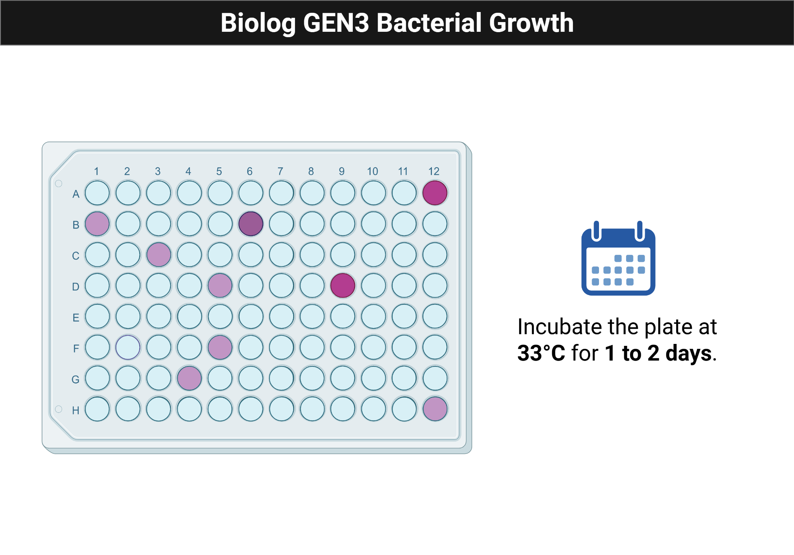

# Module 4:  Microbial Metabolism: Biolog GEN III Characterization of Strains

## Criteria for Success

Complete the in-lab assay setup, collect analyzable data, and finish the ELN entry with observations and interpretation.

## Background

Biolog Blood Universal Growth agar and GEN III MicroPlates make it possible to test bacterial growth across many environmental and chemical conditions at once. The plate uses metabolic dye chemistry to report growth and biochemical activity across up to 94 tests.

Figure @fig-module4-biolog-layout shows the overall GEN III plate layout used to interpret the phenotypic results.

{#fig-module4-biolog-layout fig-alt="Biolog GEN III plate layout showing the distribution of test conditions across the wells."}

## Procedures

### Lab Safety

#### Before Lab

- Wear lab coat, goggles, and gloves.
- Wipe benches and pipettors with 70% ethanol.

#### During Lab

- Treat all tips as biohazards.
- Remove PPE when leaving the lab.
- Use personal devices as little as possible.

#### After Lab

- Clean work areas and personal items with ethanol.
- Dispose of liquids, plates, gloves, and glass using the assigned workflow.
- Return reusable materials and wash hands.

### Methods: Activity 1, Turbidimeter

We will swab bacterial cells from your agar plates (BUG Agar: **BUG** (Biolog Universal Growth) Agar w/ 5% sheep blood), dilute in Biolog IF-A inoculation fluid, and check turbidity with a turbidimeter.

Each **student researcher pair** will need:

1. Calibrate the turbidimeter to a **"blank"** sample of inoculation fluid in a tube

  i) Using the Biolog Turbidimeter, blank the turbidimeter with a clean tube (wiped clean of dirt and fingerprints) containing uninoculated IF-A. Because the tubes used are not optically uniform, they should be blanked individually.
 
  ii) Set the 100% transmittance adjustment knob so that the meter reads 100%.
 
  iii) Record the reading.

2. Use a turbidimeter with a bacterial sample in the inoculation fluid in a tube 

  i) Collect bacteria from your streak plate by touching the Inoculatorz™ swab to the bacteria (be gentle: do not push the swab through the agar media).

  ii) Open your Inoculating Fluid **(IF)** tube and submerge the swab in the liquid. Swirl the swab around in the fluid for 15 seconds to ensure inoculation. Do not leave the liquid uncapped longer than necessary to prevent contamination. The tubes are glass: work carefully.

  iii) Cap the tube and gently invert it three (3) times to ensure thorough mixing (no bubbles).

  iv) The target cell density for our protocol is **95%T.**

::: {.callout-note}
Add more bacteria with the swab, if necessary, to get as close to this value as possible by continuing to add bacteria to the tube. Work carefully and keep the tube capped. If necessary, use another swab if you think it has touched another surface.
:::

3. Once you've reached the target cell density at **95%T**, cap the tube and proceed to the next Activity.

### Methods: Activity 2, Biolog Plate Preparation

Figure @fig-module4-biolog-loading shows the multichannel loading pattern used to inoculate each column consistently.

{#fig-module4-biolog-loading fig-alt="Illustration showing a multichannel pipette loading a Biolog plate."}

1. Pour the cell suspension into the multichannel pipette reservoir.
2. Load 8 tips onto each gasket of the multichannel pipette and fill the tips by drawing up 100 μl of cell suspension from the reservoir.
3. Use the multichannel to add **100 μl of diluted bacterial culture to each of the 96 wells** of the [GEN III MicroPlateTM](https://www.biolog.com/products/microbial-identification-microplates/gen-iii-test-panel/).

  i) If the tips touch the wells, replace your tips before delivering inoculation fluid to the next column. **Work carefully to avoid contamination!**
  ii) Use the technique practiced in Activity 1.

4. Eject the pipettor tips if any tip touches the wells of the plate, as this can cause cross-contamination between wells. Reload tips as needed.
5. Check that all wells have liquid
6. Cover the GEN III microplate with its lid and eject the pipette tips.
7. Incubate at 33°C for 1-2 days. **We will incubate four plates in a heated Agilent Biotek LogPhase 600 plate reader and take 600 nm readings every 15 minutes for 2 days to examine growth patterns.**
8. **Your second plate will be incubated statically at 33°C for 1-2 days**

Figure @fig-module4-biolog-incubation shows the expected appearance of an inoculated Biolog plate after incubation.

{#fig-module4-biolog-incubation fig-alt="Illustration of a Biolog GEN III plate after incubation with visible growth."}

If using Breathe-Easy film, follow the video: 

## Data/ Results

### Growth Curves
1. Save your raw data and share it with your group. The spreadsheet includes readings at every time point for your plate.
2. Export the Blank 600 table as a .csv file and ensure it contains:
  i) A Time column
  ii) Well columns labeled A1 through H12
  iii) No metadata rows above the table
3. Upload the .csv file to your respective Lab folder in your repository. Use the provided notebook to:
  i) Validate the dataset structure
  ii) Convert time to minutes
  iii) Plot growth curves for all wells and isolates

Run the code with your data to produce the results and charts necessary for results analysis.

::: {.callout-note}
Replace the note with your results; add images if applicable.
:::

### Result Analysis

Write an analysis of your results; explain what these results mean, and if this matches what was expected. Evaluate and analyze your results. What wells presented a color change, and what carbon source was found on each of these wells? What does this tell you about your bacteria? Were there any wells in your Biolog plate that did not have any growth? What are some of the reasons for this? Ask yourself some of these questions when you receive your bacterial growth rate results!

::: {.callout-note}
 Replace the note with your result analysis.
:::

##Discussion
- What are some advantages and disadvantages of using a multichannel pipette?

- During the inoculation, describe how you ensure that you isolate a "pure culture." Why is a "pure culture" needed for this assay?

- What is a turbidimeter, and why would measuring turbidity be important for this assay?

- Why do we need to use bacteria grown on BUG plates rather than TSA plates?

- How has your use of multichannels changed over the course of the semester? Why?

- Identify at least one change made to the lab protocol, whether intentional or accidental (e.g., wrong amount of reagent used, contamination, etc). How did, or could, this change/accident impact your final results?

::: {.callout-note}
Replace the note with your discussion.
:::

## Checklist Before Submission
- [ ] All sections completed
- [ ] Images pasted and labeled
- [ ] Discussion questions answered
- [ ] Reflection written
- [ ] Notebook saved and pushed to GitHub

