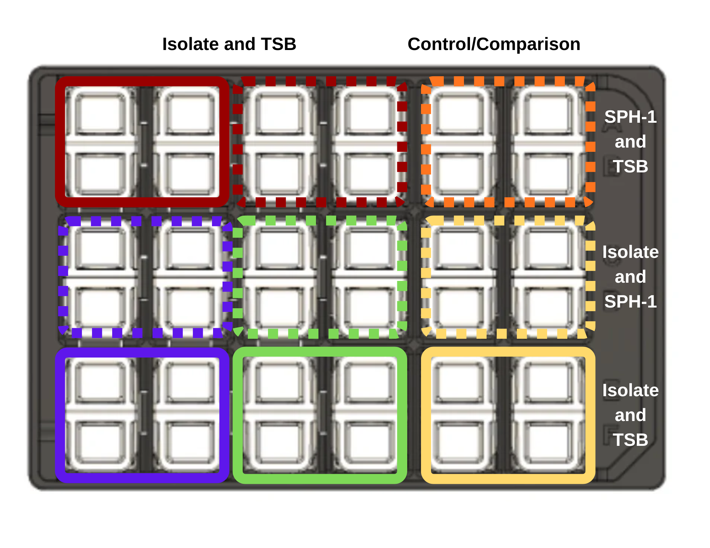

# Module 5: Microbial Interactions

## Overview

Weeks 8 and 9 focus on co-culture experiments that examine how isolates interact through diffusion-mediated contact.

## Purpose

- Evaluate microbial interactions through co-culture growth of different isolates.
- Observe growth while maintaining fluidic contact across a membrane.
- Analyze possible inhibition or facilitation patterns.
- Use pipettes to seed co-culture wells for growth assays.
- Apply the principles of the Cerillo Duet system to your research question.

## Learning Outcomes

- List safety considerations for propagating microbes.
- Explain the purpose of Duet wells and co-culture assays.
- Discuss the significance of microbial fluid interactions.
- Practice diluting cultures to a target value.
- Seed wells consistently without contamination.
- Describe the purpose, methods, and preliminary results of co-culture experiments.
- Collect and interpret co-culture growth data.
- Revise the draft for the individual and group projects.
- Explain how the experiment contributes to the overall research goal.

## Skills and Knowledge

### Skills

- Follow lab safety and PPE protocols.
- Use Cerillo vertical membrane co-culture systems correctly.
- Analyze co-culture growth data.

### Knowledge

- PPE requirements for microbial work.
- Co-culture design and growth assessment.
- Microbial interaction concepts.

## Task

Review the background and procedure information before lab and work with your partner to set up the co-culture assays and document results.

## Criteria for Success

Successful completion requires participation in assay setup, collection of analyzable data, and a complete ELN record.

## Background

After characterizing individual growth and metabolism, this module asks how isolates behave in the presence of other organisms. The Cerillo Duet co-culture platform allows isolates to grow in adjacent chambers separated by a membrane that permits exchange of metabolites without direct mixing of cells.

## Procedures

### Lab Safety

- Wear required PPE and clean benches and pipettors with 70% ethanol.
- Treat all tips as biohazards.
- Decontaminate liquids, glass, and work surfaces after lab.

### Methods

#### What Was Prepared in Advance

- Overnight cultures of each isolate were started in 2.5 mL TSB and incubated at 30 C with shaking.

#### Day of the Lab

Figure @fig-module5-duet-layout maps the isolate-only, control, and co-culture conditions across the Cerillo Duet platform.

{#fig-module5-duet-layout fig-alt="Diagram of a Cerillo Duet co-culture plate with paired chambers for controls and co-culture conditions."}

1. Dilute the overnight culture 1:1000 into fresh TSB.
2. Add 800 uL of diluted culture to triplicate wells for the isolate-only condition.
3. Add 800 uL of TSB to the adjacent control wells.
4. Add 800 uL of diluted SPH-1 to the paired experimental wells for co-culture.
5. Seal the plate carefully.
6. Incubate with shaking at 30 C for 24 to 48 hours.
7. Analyze OD600 measurements collected every 5 minutes.

### Protocol Notes

Record any mistakes, deviations, or strain-specific observations.

## Results

Add images of the co-culture plate and any figures generated from the growth data.

## Result Analysis

Compare isolate-only growth to co-culture growth. Explain whether the second organism appeared to support, suppress, or otherwise reshape your isolate's growth profile.

## Discussion Questions

1. How can co-culture systems help researchers understand microbial behavior?
2. What kinds of metabolites or resources might explain improved or reduced growth in co-culture?