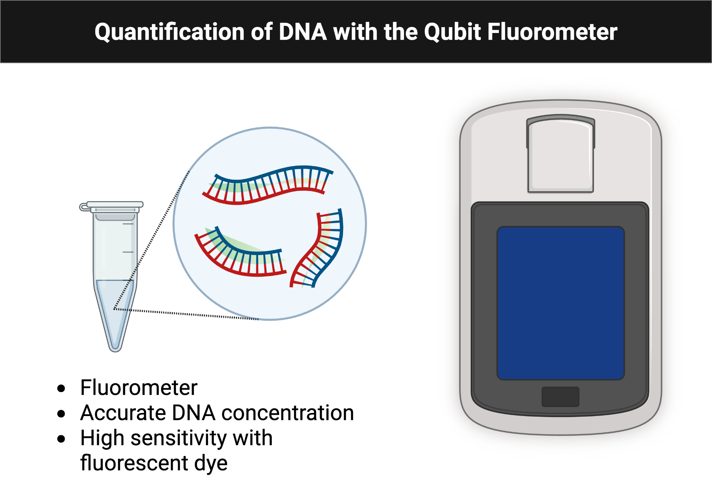
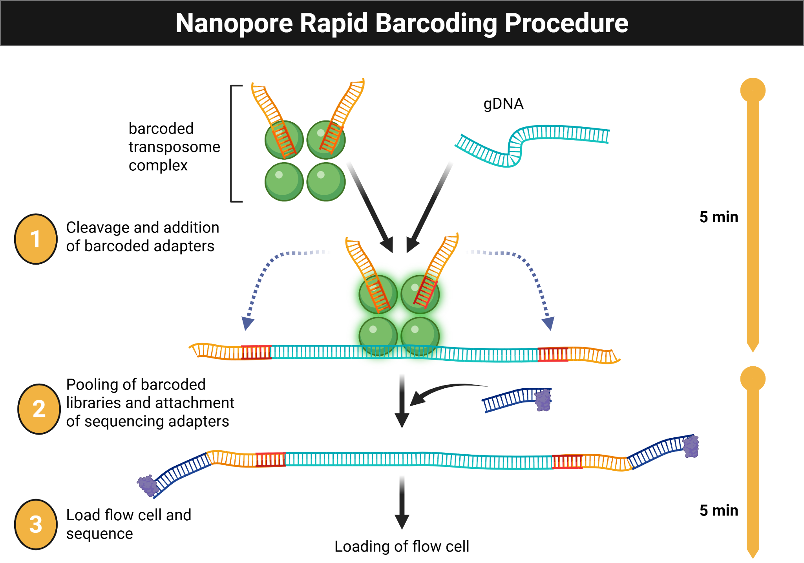

# Module 6: Microbial Genome Sequencing

## Overview

Weeks 11 and 12 focus on DNA isolation, quantification, sequencing preparation, and early genome analysis.

## Purpose

- Evaluate DNA sequencing results and microbial genome assemblies.
- Follow a standard DNA isolation protocol.
- Apply bioinformatics tools to assemble microbial genomes and analyze predicted coding sequences.

## Learning Outcomes

- List safety considerations for extracting DNA from microbial isolates.
- Explain the purpose of reagents used for DNA extraction.
- Discuss the significance of high-molecular-weight DNA for sequencing.
- Practice extracting DNA from liquid cultures.
- Practice quantifying DNA with a Qubit fluorometer.
- Describe the purpose, methods, and preliminary results of DNA extraction, quantification, and sequencing experiments.
- Collect and interpret DNA quantification and sequencing data.
- Revise the draft for the individual and group projects.
- Explain how the experiment contributes to the overall research goal.

## Skills and Knowledge

### Skills

- Follow lab safety and PPE procedures.
- Extract and quantify microbial DNA.
- Analyze microbial DNA sequence data.

### Knowledge

- PPE requirements for DNA isolation and purification.
- DNA extraction and quantification methods.
- Oxford Nanopore Technologies sequencing workflows.

## Task

Review the protocol before lab and work with your partner to isolate DNA from overnight cultures in duplicate, record all steps, and document the results.

## Criteria for Success

Successful completion requires participation in DNA isolation and sequencing preparation, collection of analyzable data, and a complete ELN entry.

## Background

This module connects phenotype to genotype by sequencing the genome of the isolate. DNA is extracted using the NO-MISS workflow and analyzed with Oxford Nanopore sequencing and downstream genome analysis tools such as BV-BRC and SeqHub.

Figure @fig-module6-sequencing-overview summarizes the sequencing and downstream analysis pipeline from isolate DNA to annotated genome.

{#fig-module6-sequencing-overview fig-alt="Workflow diagram showing nanopore sequencing followed by basecalling, assembly, and genome exploration."}

## Procedures

### Lab Safety

- Wear lab coat, goggles, and gloves.
- Clean benches and pipettors with 70% ethanol.
- Treat all culture-associated materials as biohazards.
- Decontaminate liquids, plates, and work areas at the end of the session.

### Methods

#### What Was Prepared in Advance

- Overnight cultures were started in TSB.
- Lysozyme was prepared in TE buffer at 10 mg/mL.

#### Day of the Lab

1. Pellet 1.0 mL of culture in a DNA LoBind tube.
2. Resuspend in TE buffer with lysozyme.
3. Add Proteinase K and RNase A.
4. Add CTAB buffer and incubate at 56 C for 30 minutes.
5. Combine lysate with Monarch gDNA Binding Buffer at a 2:1 ratio.
6. Bind DNA to the spin column, wash twice, and elute with preheated Monarch gDNA Elution Buffer.
7. Quantify 1 uL of DNA with the Qubit fluorometer.
8. Prepare sequencing-ready DNA according to the NO-MISS rapid barcoding workflow.

Figure @fig-module6-qubit illustrates the Qubit measurement setup used to quantify extracted DNA prior to library preparation.

{#fig-module6-qubit fig-alt="Workflow diagram showing preparation of a Qubit assay tube and fluorometer-based DNA quantification."}

Figure @fig-module6-library-prep summarizes the rapid barcoding library-preparation workflow used before sequencing.

{#fig-module6-library-prep fig-alt="Workflow diagram showing the rapid barcoding steps used to prepare DNA for nanopore sequencing."}

### Data Analysis

- Create a BV-BRC account and access the shared workspace.
- Obtain the Nanopore and Illumina files for your isolate.
- Run the Comprehensive Genome Analysis workflow.
- Upload the assembled FASTA file to SeqHub for annotation and exploration.

### Protocol Notes

Record any mistakes, deviations, or strain-specific observations.

## Results

Add figures, screenshots, concentration values, and any sequencing outputs generated from your data.

## Result Analysis

Discuss DNA yield, sample quality, and whether the sequencing-related results matched expectations. Include factors that may have affected DNA recovery and what you would change next time.

## Discussion Questions

1. How do microbial genome assembly and annotation tools support research?
2. What makes nanopore sequencing different from other sequencing approaches?