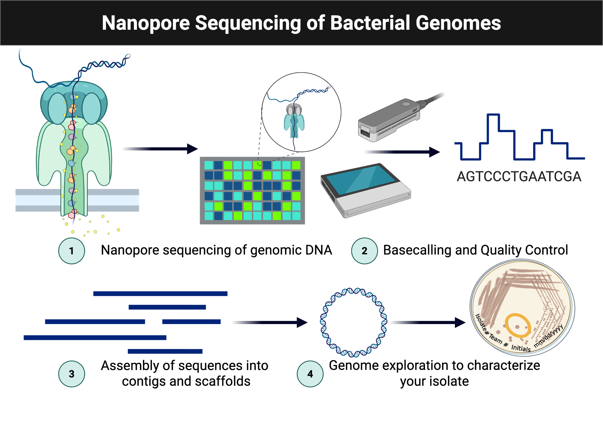

# Module 7: Data Analysis and Experimental Design

## Overview

Weeks 13 and 14 focus on genome assembly, annotation review, comparative analysis, and connecting genomic results back to phenotype.

## Purpose

- Evaluate DNA sequencing results and microbial genome assemblies.
- Submit an assembly job to BV-BRC.
- Apply bioinformatics tools to assemble genomes and analyze predicted coding sequences.

## Learning Outcomes

- Explain the purpose of the bioinformatics tools and workflows used.
- Discuss the significance of genome assembly.
- Practice using web-based bioinformatics tools.
- Explore genome assemblies and annotations.
- Describe the workflow for microbial genome assembly.
- Collect and interpret genomic data in the context of phenotypic analyses.
- Revise the draft for the individual and group projects.
- Explain how this work contributes to the overall experimental goal.

## Skills and Knowledge

### Skills

- Perform sequence-read quality review.
- Assemble microbial genomes.
- Annotate and explore genome content.

### Knowledge

- Steps required to assemble a microbial genome.
- Tools for filtering, assembly, annotation, and metabolic modeling.
- Cloud-based bioinformatics workflow submission.

## Task

Work in pairs to obtain, explore, and interpret genome data and then connect those results to the phenotypic evidence collected earlier in the course.

## Criteria for Success

Successful completion requires use of BV-BRC and SeqHub, careful documentation of outputs, and a complete ELN entry.

## Background

Students now use sequence data generated earlier in the course to compare isolates with *Delftia acidovorans* SPH-1 and other related genomes. The goal is to identify genetic features that explain observed growth and metabolic behavior.

Figure @fig-module7-sequencing-overview is reused from the sequencing workflow to anchor where assembly, annotation, and comparative analysis fit into the broader pipeline.

{#fig-module7-sequencing-overview fig-alt="Workflow diagram showing how sequencing data moves into assembly, annotation, and comparative analysis."}

## Procedures

### Lab Safety

This is a bioinformatics lab.

### Methods: Data Analysis

- Access the shared BV-BRC workspace.
- Obtain the concatenated read files for your isolate.
- Run the Comprehensive Genome Analysis workflow with long-read and paired short-read data.
- Create an output folder labeled with the isolate name.
- Submit the job and monitor the results.
- Upload the assembled FASTA file to SeqHub.

### Methods: Genome Comparisons

- Use Similar Genome Finder in BV-BRC.
- Compare your isolate against representative and public genomes.
- Save the result tables and pie-chart images.
- Use the Genome Alignment workflow for follow-up comparisons.

### Methods: Annotation Review and Genome Exploration

- Review coding-sequence counts and other reported features.
- Record the most abundant functional assignments.
- Note whether plasmids or antibiotic-resistance genes were identified.
- Explore low-confidence annotations, hypothetical genes, predicted protein interactions, and genes of interest in SeqHub.

### Protocol Notes

Record any mistakes, deviations, or isolate-specific observations.

## Results

Include tables, figures, charts, and screenshots generated from your assembly and annotation workflows.

## Result Analysis

Explain how your isolate differs from the SPH-1 reference, how well the genomic data matches the phenotype, and what the assembly metrics suggest about data quality.

## Discussion Questions

1. How did BV-BRC assemble your genome, and how good was the assembly?
2. What factors affect genome assembly quality?
3. What applications beyond research rely on gene prediction and annotation?
4. What can predicted protein interaction networks contribute to your project?