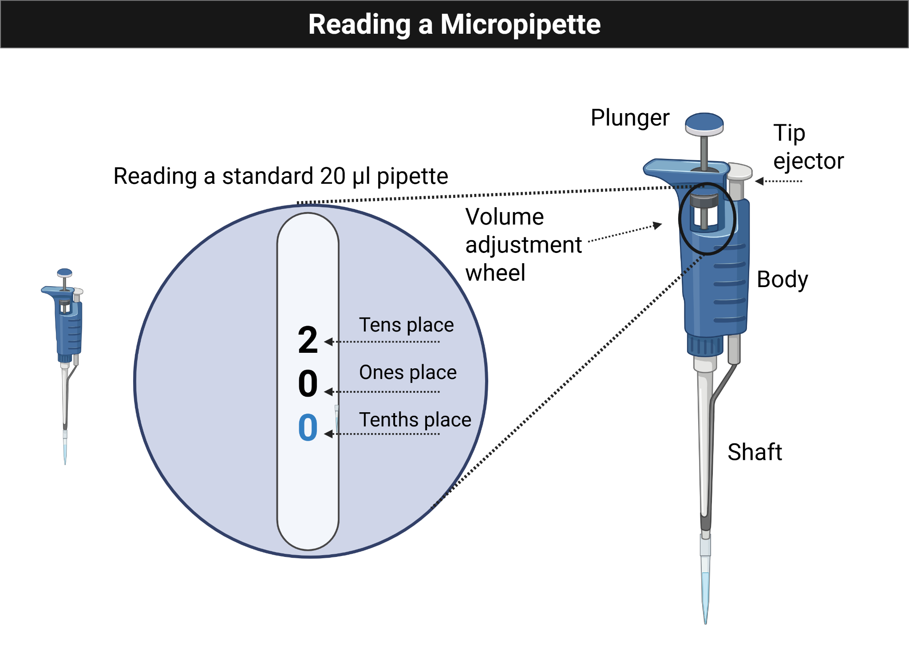
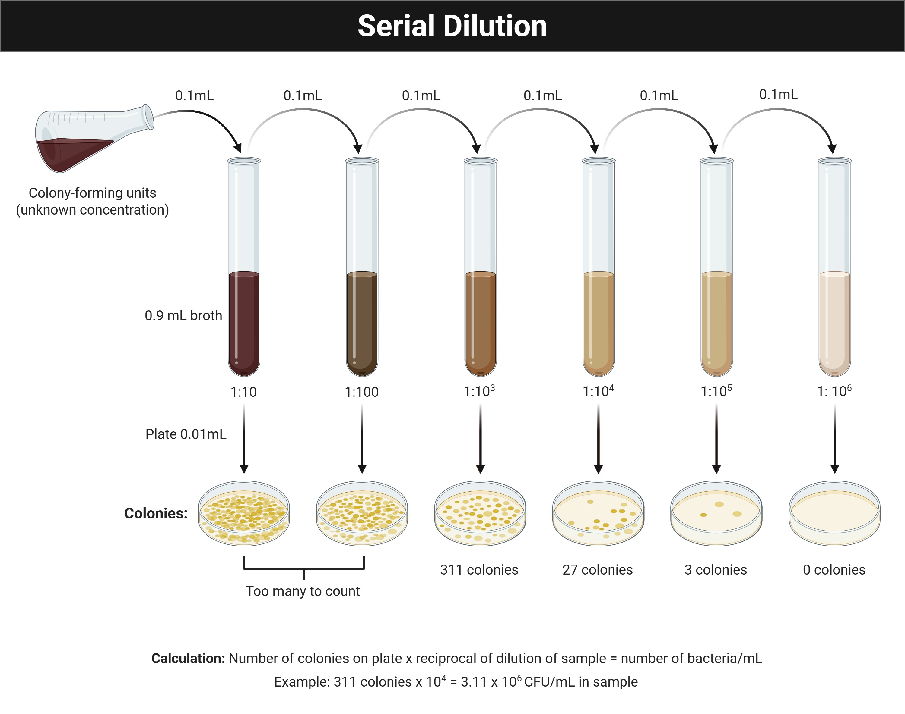

## Overview {data-background-color="#990000"}

:::{style="color:#ffffff; font-size:0.9em;"}
**Week 1** · Lab safety · Pipetting fundamentals · First ELN entries

- Review Thomas Hall lab-safety rules and personal protective equipment
- Practice mechanical micropipettes and electronic multichannel pipettes
- Document results in the Electronic Lab Notebook (ELN)
- Build a team charter and communication plan
:::

## Learning Outcomes

- **List** the personal protective equipment needed for MB 360
- **Identify** the features of the mechanical pipettes used in the course
- **Explain** how streak plating helps dilute bacteria
- **Describe** the advantages of electronic and multichannel pipettes
- **Create** a lab entry in the ELN system
- **Collect** and **interpret** pipetting data
- **Create** a team charter and communication plan

## Skills & Knowledge

:::{.columns}
:::{.column}
:::{.column-label}
Skills
:::

- Follow basic safety precautions with live bacterial organisms
- Transfer liquid volumes reproducibly with pipettors
- Document protocols, observations, and results in an ELN
- Interpret variability in pipetting performance
:::

:::{.column}
:::{.column-label}
Knowledge
:::

- Pipettor types and their volume ranges
- PPE expectations for microbial work
:::
:::

## Lab Safety

:::{.callout}
⚠ **Important:** Treat all tips as potential biohazards at all times.
:::

- **Before lab:** Wear lab coat, goggles, and gloves
- **During lab:**
  - Clean the bench before and after each session with 70% ethanol
  - Dispose of cultures and plates using designated biohazard procedures
- **After lab:** Remove PPE and decontaminate any personal items touched during lab

## Methods: Pipetting Practice

{fig-alt="Illustration of a micropipette with the volume display highlighted for reading the setting." style="max-height:280px; display:block; margin:0 auto;"}

- Add correct volume to each circle — keep drops within the circle
- Have each group member try at least two different volumes
- Practice picking up the entire drop without leaving liquid behind

## Methods: Volume Challenge

Work with blue, yellow, and red dyed water on the Pipette Practice Card.

| Step | Action |
|------|--------|
| 1–3 | Add 13.5 µL blue → dot A; 17.5 µL yellow → dot C; 17 µL red → dot E |
| 4–6 | Transfer 2 µL A→F; 4.5 µL C→B; 3 µL E→D |
| 7 | Calculate volume on each dot |
| 8–10 | Mix 6 µL E→F; 3.5 µL A→B; 5 µL C→D |

:::{.callout}
Mix by pressing to the **first stop** and releasing slowly until colors blend.
:::

## Serial Dilutions: Background

{fig-alt="Diagram showing a serial dilution sequence from a concentrated source through progressively diluted samples." style="max-height:260px; display:block; margin:0 auto;"}

Serial dilution = stepwise dilution by a constant factor  
This module uses **1:10 dilutions of crystal violet** in a 96-well plate.

## Serial Dilutions: Protocol

{fig-alt="Photo of the top rows of a 96-well microplate used as a planning guide for serial dilution." style="max-height:200px; display:block; margin:0 auto;"}

1. Add 50 µL water to each well in row A
2. Add 50 µL crystal violet to well A1 and mix
3. Transfer 50 µL A1 → A2; repeat through A12
4. Discard final 50 µL after mixing A12
5. Repeat for rows B, C, D; add 100 µL water to H12 (negative control)
6. Compare rows visually, then measure absorbance with plate reader

## Results & Analysis

**Collect**

- Photo of the completed pipetting card (annotated)
- Written notes on observations during volume-challenge and serial-dilution steps

**Analyze**

- Did liquid transfers match expectations?
- What do results suggest about your current pipetting precision?

## Discussion Questions

1. Did you make bubbles while mixing? What caused them?
2. Was any liquid left on the card, or was there air space in the pipette tip after transfer?
3. Based on your results, how would you rate your pipetting skill?
4. What is the dilution factor in the serial dilution series?
5. Did the visual pattern match your prediction?
6. Did the plate-reader data match your qualitative observations?

## {.closing}

:::{.closing}
{.closing-logo fig-alt="MB 360 Lab Workbook logo"}

**Module 1 Complete — Getting Started**

:::{.closing-note}
MB 360 Lab Workbook · Carlos C. Goller, Ph.D. · NC State University
:::
:::
