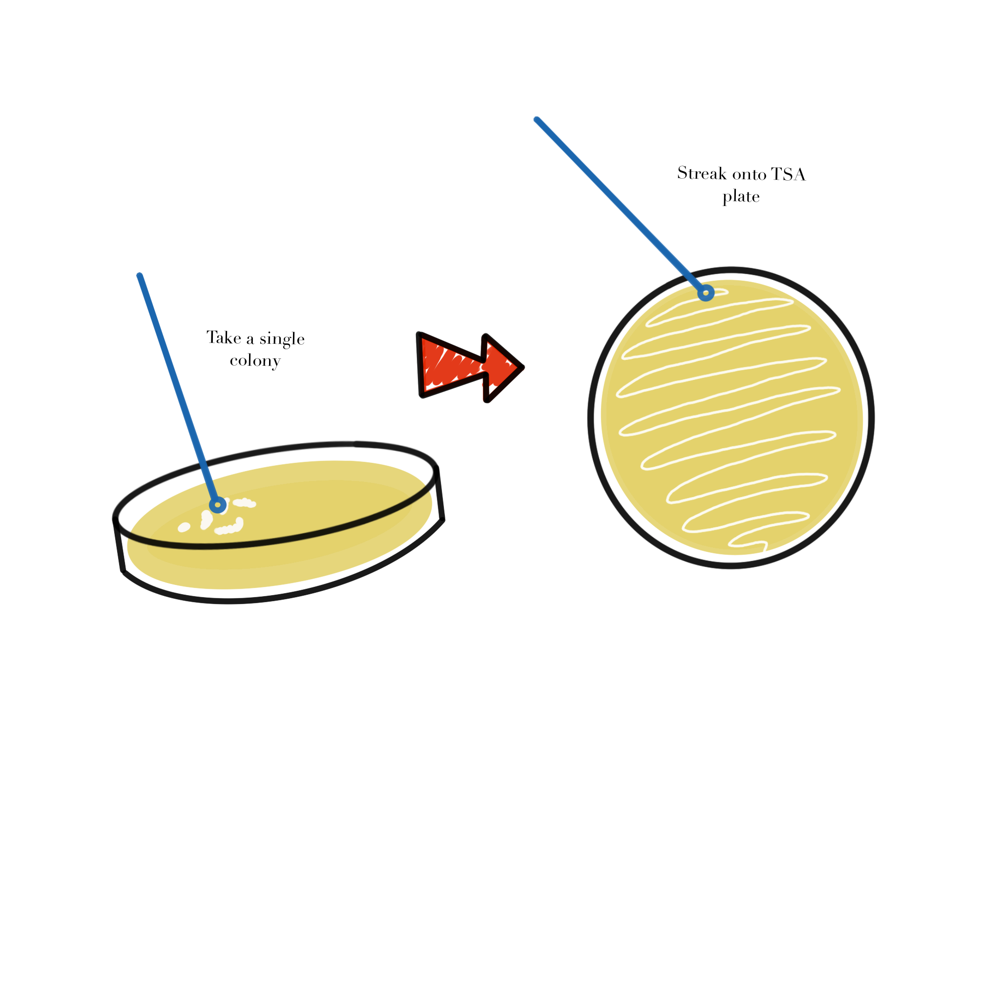

# Module 2: Microbial Propagation {.title-slide data-background-color="#1f4e79"}

### MB 360: Scientific Inquiry in Microbiology At the Bench

MB 360 Lab Workbook  
NC State University | Department of Biological Sciences

## Overview {.overview-slide data-background-color="#1f4e79"}

:::{style="color:#ffffff; font-size:0.9em;"}
**Weeks 2–3** · Plate streaking · Colony observation · Liquid cultures

- Recover and propagate *Delftia acidovorans* from colonies
- Observe colony morphology and start liquid cultures
- Review safety procedures for live microbial isolates
:::

## Learning Outcomes

- **List** items needed to propagate microbes in liquid cultures and 96-well plates
- **Explain** the stages of bacterial growth on a growth-curve graph
- **Describe** defined, complex, selective, enriched, and differential media
- **Discuss** the importance of controls
- **Practice** inoculating and diluting liquid cultures
- **Collect** and **interpret** colony morphology and growth data
- **Create** and **use** a team data management plan

## Skills & Knowledge

:::{.columns}
:::{.column}
:::{.column-label}
Skills
:::

- Work safely with bacterial growth on agar plates
- Document protocols and results clearly
- Interpret colony morphology and growth in TSB medium
- Propagate bacteria in liquid culture
:::

:::{.column}
:::{.column-label}
Knowledge
:::

- PPE for microbial work
- Loop use, sterilization, and streaking methods
- Propagation in solid and liquid media
:::
:::

## Lab Safety

:::{.columns}
:::{.column}
**Before Lab**

- Wear lab coat, goggles, and gloves
- Wipe the bench and pipettors with 70% ethanol

**During Lab**

- Treat all tips as potential biohazards
- Remove PPE when leaving the lab
- Discard samples and disposables correctly
:::

:::{.column}
**After Lab**

- Wipe the station with 70% ethanol
- Decontaminate any personal items touched during lab
- Dispose of gloves in the main biohazard container
:::

## Methods: Colony Morphology

:::{.callout}
⚠ We are working with live microbial isolates today — follow all safety protocols.
:::

- Obtain a TSA plate containing colonies of your isolate
- Observe colony appearance **without opening the plate**
- Record: size, shape, colour, texture, any other visible features
- Photograph the plate on the black background
- Share photos with all team members

## Methods: Plate Streaking

{fig-alt="Diagram showing a sterile loop transferring a single colony onto a fresh agar plate for streaking." style="max-height:260px; display:block; margin:0 auto;"}

- Use a sterile loop to pick a **single colony**
- Open the plate as little as possible
- Streak onto a fresh TSA plate
- Label the bottom edge: name · class · date

## Methods: Starting a Liquid Culture

1. Obtain TSB and sterile culture tubes
2. Label tubes: TSB control, your isolate, *Delftia acidovorans* SPH-1
3. Transfer a colony into the labeled tube (do not touch loop to any other surface)
4. Cap each tube correctly
5. Place in a shaking incubator at **30 °C**
6. Incubate for **24 hours**

## Results & Analysis

### Collect
- Photo of the streak plate
- Notes on colony features (size, shape, colour, surface)

### Analyze
- Did the observed colony features and culture setup match expectations?
- What differences would you predict between static and shaking liquid growth?

## Discussion Questions

1. If a student touched the agar with a thumb and unexpected colonies appeared later, what was the likely source of contamination and how could it have been prevented?
2. What differences would you predict between static and shaking liquid growth?

## {.closing}

:::{.closing}
{.closing-logo fig-alt="MB 360 Lab Workbook logo"}

**Module 2 Complete — Microbial Propagation**

:::{.closing-note}
MB 360 Lab Workbook · Carlos C. Goller, Ph.D. · NC State University
:::
:::
