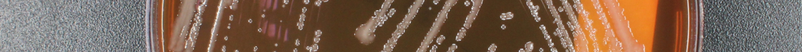

## Module 2: Microbial Propagation {.title-slide data-background-color="#990000"}

MB 360: Scientific Inquiry in Microbiology At the Bench

MB 360 Lab Workbook NC State University | Department of Biological Sciences

## Overview {data-background-color="#990000"}

:::{.overview-summary}
**Weeks 2–3** · Plate streaking · Colony observation · Liquid cultures

- Recover and propagate *Delftia acidovorans* from colonies
- Observe colony morphology and start liquid cultures
- Review safety procedures for live microbial isolates
:::

## Learning Outcomes

- **List** items needed to propagate microbes in liquid cultures and 96-well plates
- **Explain** the stages of bacterial growth on a growth-curve graph
- **Describe** defined, complex, selective, enriched, and differential media
- **Discuss** the importance of controls
- **Practice** inoculating and diluting liquid cultures
- **Collect** and **interpret** colony morphology and growth data
- **Create** and **use** a team data management plan

## Skills & Knowledge

:::{.columns}
:::{.column}
:::{.column-label}
Skills
:::

- Work safely with bacterial growth on agar plates
- Document protocols and results clearly
- Interpret colony morphology and growth in TSB medium
- Propagate bacteria in liquid culture
:::

:::{.column}
:::{.column-label}
Knowledge
:::

- PPE for microbial work
- Loop use, sterilization, and streaking methods
- Propagation in solid and liquid media
:::
:::

## Lab Safety

:::{.columns}
:::{.column}
**Before Lab**

- Wear lab coat, goggles, and gloves
- Wipe the bench and pipettors with 70% ethanol

**During Lab**

- Treat all tips as potential biohazards
- Remove PPE when leaving the lab
- Discard samples and disposables correctly
:::

:::{.column}
**After Lab**

- Wipe the station with 70% ethanol
- Decontaminate any personal items touched during lab
- Dispose of gloves in the main biohazard container
:::
:::

## Methods: Colony Morphology

:::{.callout role="note" aria-label="Lab safety reminder"}
**Important:** We are working with live microbial isolates today — follow all safety protocols.
:::

- Obtain a TSA plate containing colonies of your isolate
- Observe colony appearance **without opening the plate**
- Record: size, shape, colour, texture, any other visible features
- Photograph the plate on the black background

## Methods: Streak Plating

{fig-alt="Diagram of a three-phase streak pattern on an agar plate for bacterial isolation." style="max-height:260px; display:block; margin:0 auto;"}

1. Sterilise the inoculation loop in the flame until glowing red
2. Cool the loop briefly on the unused edge of the agar
3. Pick a single colony from the original plate
4. Streak zone 1 (≈ 5 parallel lines) across one-quarter of a fresh TSA plate
5. Sterilise the loop; rotate the plate 90°; streak zone 2 from the end of zone 1
6. Repeat to create zone 3 and zone 4 for maximum dilution
7. Invert and incubate at 30 °C for 48 h

## Methods: Liquid Culture Inoculation

1. Label a 15 mL tube with isolate name, date, and group
2. Add 5 mL sterile TSB
3. Pick one well-isolated colony with a sterile loop
4. Swirl the loop in the TSB to release the cells
5. Cap loosely and incubate at **30 °C with shaking** (200–250 RPM) for 24–48 h

## Results & Discussion

- Compare colony morphology on TSA to your initial description
- Describe turbidity of the liquid culture (clear, slightly turbid, very turbid)
- Record any unexpected observations or contamination events

## Reflection Questions

1. Why do we sterilise the loop between zones during streak plating?
2. What is the difference between a pure culture and a mixed culture?
3. How does liquid culture growth differ visually from growth on solid media?
