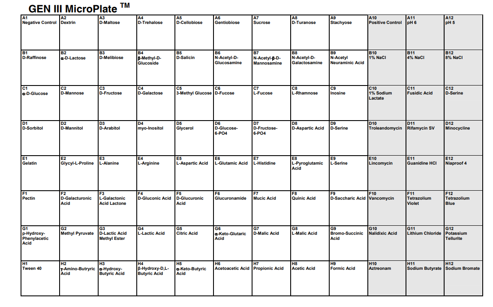
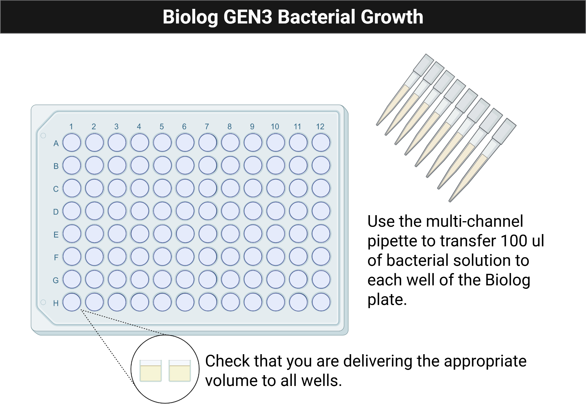

## Module 4: Microbial Metabolism {.title-slide data-background-color="#1f4e79"}

MB 360: Scientific Inquiry in Microbiology At the Bench

MB 360 Lab Workbook NC State University | Department of Biological Sciences

## Overview {data-background-color="#1f4e79"}

:::{.overview-summary}
**Weeks 6–7** · Biolog GEN III phenotypic characterization · Growth measurements · Metabolic interpretation

- Evaluate bacterial growth across many chemical and environmental conditions
- Perform metabolic profiling with GEN III MicroPlates
- Connect phenotypic data to the overall research question
:::

## Learning Outcomes

- **List** safety considerations for propagating microbes
- **Explain** the purpose of GEN III Biolog plates and metabolic tests
- **Describe** the features of biofilms
- **Discuss** the significance of growth curves
- **Practice** multichannel pipetting; use a turbidimeter to adjust inoculum density
- **Collect** and **interpret** growth data from Biolog GEN III plates
- **Create** a draft for the individual and group projects

## Skills & Knowledge

:::{.columns}
:::{.column}
:::{.column-label}
Skills
:::

- Follow PPE and microbial safety procedures
- Use Biolog plates and multichannel pipettors correctly
- Adjust bacterial density with a turbidimeter
- Analyze bacterial growth data from 96-well plates
:::

:::{.column}
:::{.column-label}
Knowledge
:::

- PPE requirements for microbial work
- Phenotypic assays and growth assessment
- Seeding 96-well plates for bacterial growth
:::
:::

## Background: Biolog GEN III

{fig-alt="Biolog GEN III plate layout showing the distribution of test conditions across the wells." style="max-height:260px; display:block; margin:0 auto;"}

Biolog Blood Universal Growth (BUG) agar + GEN III MicroPlates  
→ test bacterial growth across **94 conditions** at once using metabolic dye chemistry

## Lab Safety

:::{.columns}
:::{.column}
**Before Lab**

- Wear lab coat, goggles, and gloves
- Wipe benches and pipettors with 70% ethanol

**During Lab**

- Treat all tips as biohazards
- Remove PPE when leaving the lab
:::

:::{.column}
**After Lab**

- Clean work areas and personal items with ethanol
- Dispose of liquids, plates, gloves, and glass using the assigned workflow
- Return reusable materials and wash hands
:::
:::

## Methods: Activity 1, Turbidimeter

- Blank the turbidimeter with uninoculated IF-A fluid
- Swab bacteria from the BUG agar plate into IF-A inoculating fluid
- Mix gently and measure turbidity
- Adjust the inoculum to **95% transmittance**

## Methods: Activity 2, Biolog Plate Preparation

{fig-alt="Illustration showing a multichannel pipette transferring inoculum into a Biolog plate." style="max-height:260px; display:block; margin:0 auto;"}

- Pour the prepared cell suspension into a multichannel reservoir
- Add **100 µL** to each well of the GEN III plate with the multichannel pipette
- Replace tips whenever contamination is possible
- Confirm that every well contains liquid before incubation
- Incubate one plate in the plate reader and one statically at **33 °C** for 1 to 2 days

## Results & Discussion

- Save and share the raw **600 nm** readings
- Export the blank-corrected table as CSV
- Plot growth curves and interpret wells with or without growth
- Identify carbon sources that appear supportive and conditions that inhibited the isolate

## Reflection Questions

1. What does a turbidimeter measure, and why is it important for this assay?
2. Why are BUG-grown bacteria used instead of TSA-grown bacteria?
3. How has your multichannel technique changed over the semester?
