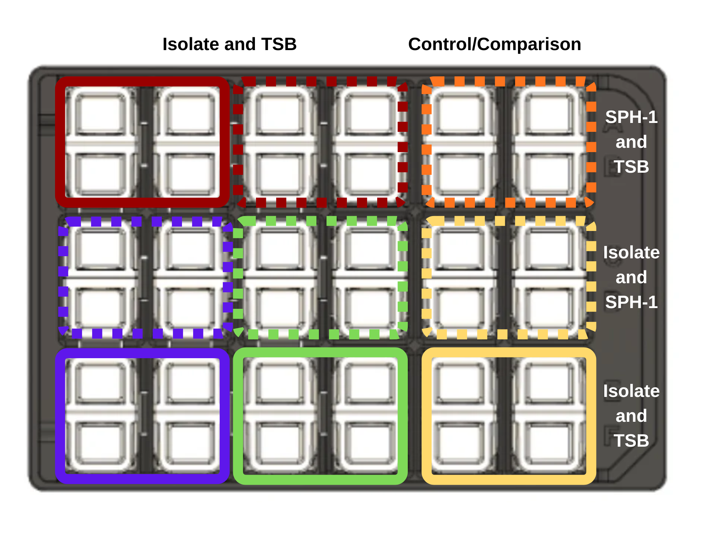

# Module 5: Microbial Interactions {.title-slide data-background-color="#1f4e79"}

### MB 360: Scientific Inquiry in Microbiology At the Bench

MB 360 Lab Workbook  
NC State University | Department of Biological Sciences

## Overview {data-background-color="#1f4e79"}

:::{style="color:#ffffff; font-size:0.9em;"}
**Weeks 8–9** · Co-culture experiments · Diffusion-mediated contact · Growth data analysis

- Evaluate microbial interactions through co-culture of different isolates
- Observe growth while maintaining fluidic contact across a membrane
- Analyze inhibition or facilitation patterns
:::

## Learning Outcomes

- **List** safety considerations for propagating microbes
- **Explain** the purpose of Duet wells and co-culture assays
- **Discuss** the significance of microbial fluid interactions
- **Practice** diluting cultures to a target value
- **Seed** wells consistently without contamination
- **Collect** and **interpret** co-culture growth data
- **Revise** the draft for the individual and group projects

## Skills & Knowledge

:::{.columns}
:::{.column}
:::{.column-label}
Skills
:::

- Follow lab safety and PPE protocols
- Use Cerillo vertical membrane co-culture systems correctly
- Analyze co-culture growth data
:::

:::{.column}
:::{.column-label}
Knowledge
:::

- PPE requirements for microbial work
- Co-culture design and growth assessment
- Microbial interaction concepts
:::
:::

## Background: Cerillo Duet System

Adjacent chambers separated by a **membrane** allow exchange of metabolites without direct mixing of cells.

Questions this module addresses:

- Does *Delftia acidovorans* SPH-1 support, suppress, or reshape your isolate's growth?
- What metabolites or resources might explain the observed pattern?

## Lab Safety

- Wear required PPE; clean benches and pipettors with 70% ethanol
- Treat all tips as biohazards
- Decontaminate liquids, glass, and work surfaces after lab

## Methods: Day of the Lab

{fig-alt="Diagram of a Cerillo Duet co-culture plate with paired chambers for controls and co-culture conditions." style="max-height:220px; display:block; margin:0 auto;"}

1. Dilute overnight culture 1:1000 into fresh TSB
2. Add 800 µL diluted culture to triplicate isolate-only wells
3. Add 800 µL TSB to adjacent control wells
4. Add 800 µL diluted SPH-1 to paired experimental wells

## Methods: Incubation & Measurement

5. Seal the plate carefully
6. Incubate with shaking at **30 °C for 24–48 hours**
7. Analyze OD₆₀₀ measurements collected **every 5 minutes**

## Results & Analysis

### Collect
- Images of the co-culture plate
- Figures generated from OD₆₀₀ growth data

### Analyze
- Compare isolate-only growth to co-culture growth
- Did the second organism support, suppress, or reshape your isolate's growth profile?

## Discussion Questions

1. How can co-culture systems help researchers understand microbial behaviour?
2. What kinds of metabolites or resources might explain improved or reduced growth in co-culture?

## {.closing}

:::{.closing}
{.closing-logo fig-alt="MB 360 Lab Workbook logo"}

**Module 5 Complete — Microbial Interactions**

:::{.closing-note}
MB 360 Lab Workbook · Carlos C. Goller, Ph.D. · NC State University
:::
:::
