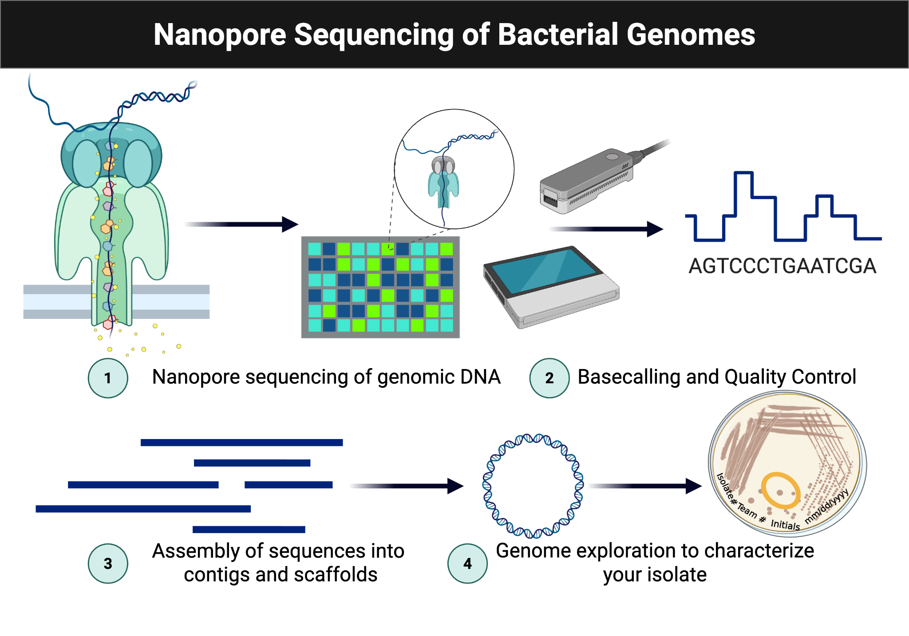

## Module 6: Microbial Genome Sequencing {.title-slide data-background-color="#990000"}

MB 360: Scientific Inquiry in Microbiology At the Bench

MB 360 Lab Workbook NC State University | Department of Biological Sciences

## Overview {data-background-color="#990000"}

:::{.overview-summary}
**Weeks 11–12** · DNA isolation · Quantification · Sequencing preparation · Early genome analysis

- Connect phenotype to genotype by sequencing the isolate genome
- Use the NO-MISS workflow for DNA extraction
- Analyse with Oxford Nanopore sequencing, BV-BRC, and SeqHub
:::

## Learning Outcomes

- **List** safety considerations for extracting DNA from microbial isolates
- **Explain** the purpose of reagents used for DNA extraction
- **Discuss** the significance of high-molecular-weight DNA for sequencing
- **Practice** DNA extraction and Qubit fluorometer quantification
- **Collect** and **interpret** DNA quantification and sequencing data
- **Revise** the draft for the individual and group projects

## Skills & Knowledge

:::{.columns}
:::{.column}
:::{.column-label}
Skills
:::

- Follow lab safety and PPE procedures
- Extract and quantify microbial DNA
- Analyse microbial DNA sequence data
:::

:::{.column}
:::{.column-label}
Knowledge
:::

- PPE requirements for DNA isolation
- DNA extraction and quantification methods
- Oxford Nanopore Technologies sequencing workflows
:::
:::

## Background: Sequencing Pipeline

{fig-alt="Workflow diagram showing nanopore sequencing followed by basecalling, assembly, and genome exploration." style="max-height:280px; display:block; margin:0 auto;"}

**NO-MISS extraction → Nanopore sequencing → BV-BRC assembly → SeqHub annotation**

## Lab Safety

- Wear lab coat, goggles, and gloves
- Clean benches and pipettors with 70% ethanol
- Treat all culture-associated materials as biohazards
- Decontaminate liquids, plates, and work areas at the end of the session

## Methods: DNA Extraction

1. Pellet 1.0 mL of culture in a DNA LoBind tube
2. Resuspend in TE buffer with **lysozyme**
3. Add **Proteinase K** and **RNase A**
4. Add **CTAB buffer**; incubate at 56 °C for 30 minutes
5. Combine lysate with Monarch gDNA Binding Buffer (2:1)
6. Transfer lysate to a **Monarch gDNA Column**; centrifuge to bind DNA
7. Wash with **Wash Buffer** (×2)
8. Elute with **50 µL warm elution buffer** (pre-heated to 65 °C)

## Methods: DNA Quantification (Qubit)

1. Prepare the Qubit working solution: **199 µL buffer + 1 µL reagent** per sample
2. Add **198 µL** working solution to two standard tubes; add 2 µL of each standard
3. Add **197 µL** working solution to the sample tube; add **3 µL** of your eluate
4. Vortex all tubes; incubate 2 min in the dark
5. Read on the Qubit fluorometer using the **dsDNA BR** or **HS** assay
6. Record ng/µL concentration and calculate total yield

## Results & Discussion

- Record Qubit concentration and total DNA yield
- Determine whether yield meets the sequencing threshold (≥ 400 ng total)
- Note any low-yield samples and discuss likely causes (over-dilution, lysis inefficiency)

## Reflection Questions

1. Why is high-molecular-weight DNA important for long-read nanopore sequencing?
2. What role does the CTAB buffer play in the NO-MISS extraction workflow?
3. How would you troubleshoot a Qubit reading of 0 ng/µL?
