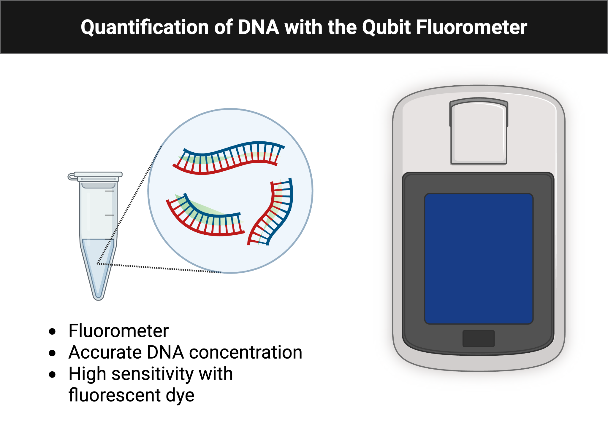
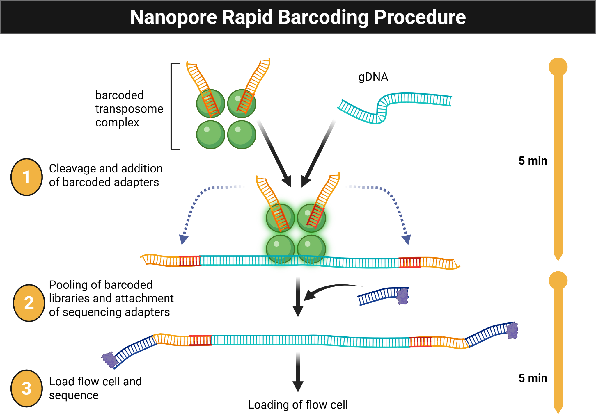

# Module 6: Microbial Genome Sequencing {.title-slide data-background-color="#1f4e79"}

### MB 360: Scientific Inquiry in Microbiology At the Bench

MB 360 Lab Workbook  
NC State University | Department of Biological Sciences

## Overview {data-background-color="#1f4e79"}

:::{style="color:#ffffff; font-size:0.9em;"}
**Weeks 11–12** · DNA isolation · Quantification · Sequencing preparation · Early genome analysis

- Connect phenotype to genotype by sequencing the isolate genome
- Use the NO-MISS workflow for DNA extraction
- Analyse with Oxford Nanopore sequencing, BV-BRC, and SeqHub
:::

## Learning Outcomes

- **List** safety considerations for extracting DNA from microbial isolates
- **Explain** the purpose of reagents used for DNA extraction
- **Discuss** the significance of high-molecular-weight DNA for sequencing
- **Practice** DNA extraction and Qubit fluorometer quantification
- **Collect** and **interpret** DNA quantification and sequencing data
- **Revise** the draft for the individual and group projects

## Skills & Knowledge

:::{.columns}
:::{.column}
:::{.column-label}
Skills
:::

- Follow lab safety and PPE procedures
- Extract and quantify microbial DNA
- Analyse microbial DNA sequence data
:::

:::{.column}
:::{.column-label}
Knowledge
:::

- PPE requirements for DNA isolation
- DNA extraction and quantification methods
- Oxford Nanopore Technologies sequencing workflows
:::
:::

## Background: Sequencing Pipeline

{fig-alt="Workflow diagram showing nanopore sequencing followed by basecalling, assembly, and genome exploration." style="max-height:280px; display:block; margin:0 auto;"}

**NO-MISS extraction → Nanopore sequencing → BV-BRC assembly → SeqHub annotation**

## Lab Safety

- Wear lab coat, goggles, and gloves
- Clean benches and pipettors with 70% ethanol
- Treat all culture-associated materials as biohazards
- Decontaminate liquids, plates, and work areas at the end of the session

## Methods: DNA Extraction

1. Pellet 1.0 mL of culture in a DNA LoBind tube
2. Resuspend in TE buffer with **lysozyme**
3. Add **Proteinase K** and **RNase A**
4. Add **CTAB buffer**; incubate at 56 °C for 30 minutes
5. Combine lysate with Monarch gDNA Binding Buffer (2:1)
6. Bind DNA to spin column; wash twice; elute with preheated Monarch gDNA Elution Buffer

## Methods: DNA Quantification

{fig-alt="Workflow diagram showing preparation of a Qubit assay tube and fluorometer-based DNA quantification." style="max-height:240px; display:block; margin:0 auto;"}

7. Quantify **1 µL of DNA** with the Qubit fluorometer

## Methods: Library Preparation

{fig-alt="Workflow diagram showing the rapid barcoding steps used to prepare DNA for nanopore sequencing." style="max-height:240px; display:block; margin:0 auto;"}

8. Prepare sequencing-ready DNA using the **NO-MISS rapid barcoding workflow**

## Methods: Data Analysis

- Create a BV-BRC account and access the shared workspace
- Obtain Nanopore and Illumina files for your isolate
- Run the **Comprehensive Genome Analysis** workflow
- Upload assembled FASTA to **SeqHub** for annotation and exploration

## Results & Analysis

### Collect
- Concentration values from Qubit
- Assembly outputs, screenshots, and sequencing figures

### Analyze
- Discuss DNA yield, sample quality, and whether results matched expectations
- What factors may have affected DNA recovery, and what would you change?

## Discussion Questions

1. How do microbial genome assembly and annotation tools support research?
2. What makes nanopore sequencing different from other sequencing approaches?

## {.closing}

:::{.closing}
{.closing-logo fig-alt="MB 360 Lab Workbook logo"}

**Module 6 Complete — Microbial Genome Sequencing**

:::{.closing-note}
MB 360 Lab Workbook · Carlos C. Goller, Ph.D. · NC State University
:::
:::
