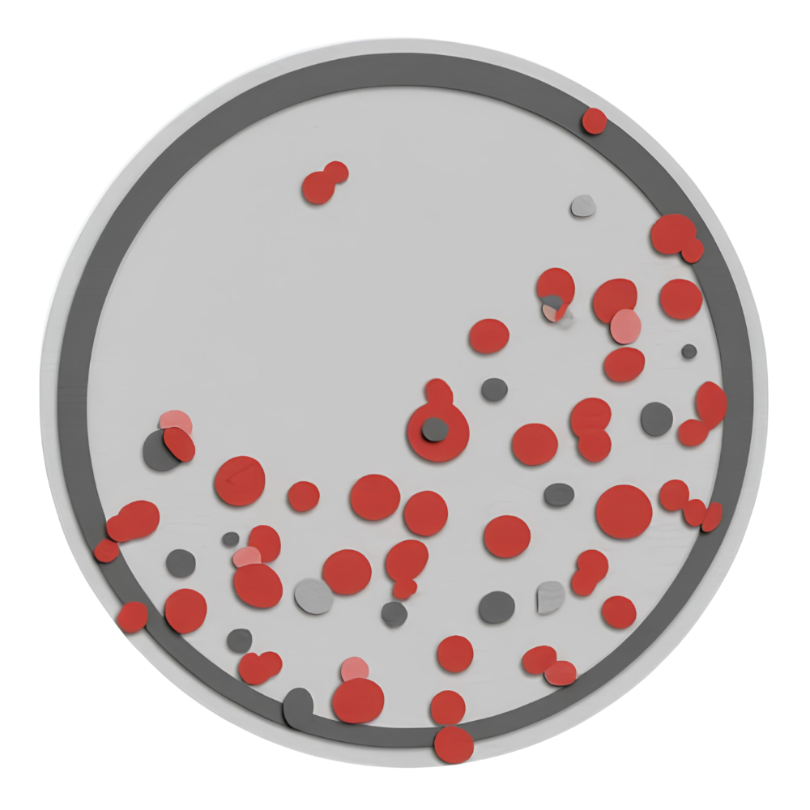

## Overview {data-background-color="#990000"}

:::{style="color:#ffffff; font-size:0.9em;"}
**Weeks 13–14** · Genome assembly · Annotation review · Comparative analysis · Phenotype connection

- Submit an assembly job to BV-BRC
- Apply bioinformatics tools to assemble and annotate genomes
- Connect genomic results back to phenotypic evidence
:::

## Learning Outcomes

- **Explain** the purpose of bioinformatics tools and workflows used
- **Discuss** the significance of genome assembly
- **Practice** using web-based bioinformatics tools
- **Explore** genome assemblies and annotations
- **Collect** and **interpret** genomic data in the context of phenotypic analyses
- **Revise** the draft for the individual and group projects

## Skills & Knowledge

:::{.columns}
:::{.column}
:::{.column-label}Skills:::{.column-label}

- Perform sequence-read quality review
- Assemble microbial genomes
- Annotate and explore genome content
:::

:::{.column}
:::{.column-label}Knowledge:::{.column-label}

- Steps required to assemble a microbial genome
- Tools for filtering, assembly, annotation, and metabolic modelling
- Cloud-based bioinformatics workflow submission
:::
:::

## Background

{fig-alt="Workflow diagram showing how sequencing data moves into assembly, annotation, and comparative analysis." style="max-height:260px; display:block; margin:0 auto;"}

Compare your isolate to *Delftia acidovorans* SPH-1 and related public genomes to identify genetic features that explain observed growth and metabolic behaviour.

## Lab Safety

This is a **bioinformatics lab** — no live organisms or chemicals are used today.

## Methods: Genome Assembly (BV-BRC)

1. Access the shared BV-BRC workspace
2. Obtain the concatenated read files for your isolate
3. Run the **Comprehensive Genome Analysis** workflow  
   (long-read + paired short-read data)
4. Create an output folder labelled with the isolate name
5. Submit the job and monitor the results
6. Upload the assembled FASTA file to **SeqHub**

## Methods: Genome Comparisons

- Use **Similar Genome Finder** in BV-BRC
- Compare your isolate against representative and public genomes
- Save result tables and pie-chart images
- Use the **Genome Alignment** workflow for follow-up comparisons

## Methods: Annotation Review

- Review coding-sequence counts and reported features
- Record the most abundant functional assignments
- Note whether plasmids or antibiotic-resistance genes were identified
- Explore low-confidence annotations, hypothetical genes, predicted protein interactions in **SeqHub**

## Results & Analysis

**Collect**

- Tables, figures, charts, and screenshots from assembly and annotation workflows

**Analyze**

- How does your isolate differ from the SPH-1 reference?
- How well does genomic data match the phenotype?
- What do assembly metrics suggest about data quality?

## Discussion Questions

1. How did BV-BRC assemble your genome, and how good was the assembly?
2. What factors affect genome assembly quality?
3. What applications beyond research rely on gene prediction and annotation?
4. What can predicted protein interaction networks contribute to your project?

## {.closing}

:::{.closing}
{.closing-logo fig-alt="MB 360 Lab Workbook logo"}

**Module 7 Complete — Data Analysis and Experimental Design**

:::{.closing-note}
MB 360 Lab Workbook · Carlos C. Goller, Ph.D. · NC State University
:::
:::
